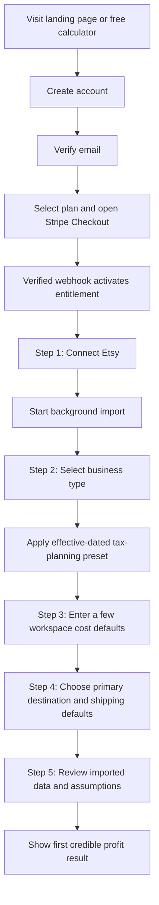
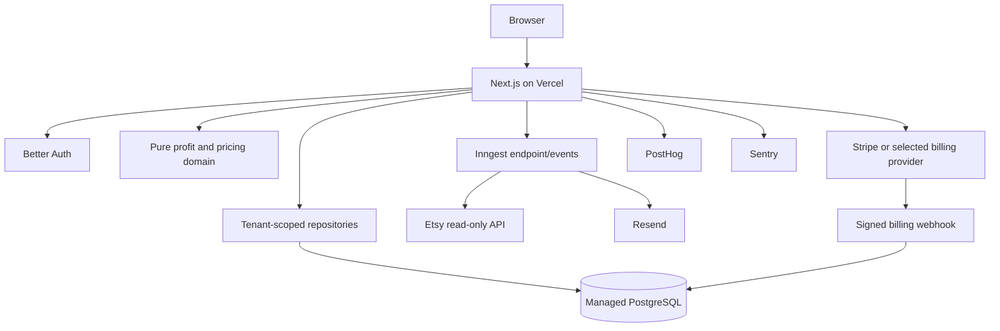

# MarmaraLedge SaaS — Codex Implementation Blueprint

**Document type:** Product Requirements Document + Technical Architecture + Codex Execution Plan  
**Status:** Implementation-ready baseline — revised for in-place conversion, Stripe, Turkey-first positioning, and fast onboarding  
**Source baseline:** `MarmaraMade Ledger — Complete Product and Technical Documentation`  
**Primary objective:** Convert the current MarmaraMade Ledger repository in place into a focused, secure, multi-tenant SaaS for Turkey-based physical Etsy exporters. The product calculates complete profitability—including product cost, labor, packaging, marketplace fees, shipping, export handling, customs/tariffs, overhead, business-type tax-planning presets, reserves, and FX—and supports bulk portfolio scenarios such as selling an entire catalog to a destination country.

---

## Founder decisions that override earlier assumptions

The following decisions are final unless the founder explicitly changes them later:

1. Convert the existing MarmaraMade Ledger repository **in place**. Do not create a separate SaaS repository.
2. The current repository becomes MarmaraLedge; private-only screens and models may be removed, archived, or migrated as part of the conversion.
3. Use the current Git repository and history. Create a safety tag and backup before structural changes, then implement through small, atomic commits.
4. Use **Stripe Billing** for paid subscriptions. Do not add Paddle or Lemon Squeezy as launch alternatives. Keep product entitlement logic isolated from Stripe SDK calls, but do not delay implementation for provider selection.
5. The product is not a generic Etsy fee calculator. Its differentiator is **complete landed-cost and business-profit calculation** across all relevant costs in one model.
6. A bulk portfolio/destination scenario planner is part of the core product. Example: a seller selects 100 products and asks, “If every selected unit sells to the United States under these assumptions, what are total revenue, fees, shipping, tariffs, taxes/reserves, FX effects, and final net profit?”
7. Shipping, customs, tariffs, export handling, and tax-planning inputs must remain explicit, versioned, and explainable. Unknown transactional costs must never be silently treated as zero.
8. Year-one positioning is Turkey-first: Turkey-based sellers exporting physical products through Etsy. Global-ready currency and tenancy architecture remain, but product copy, onboarding presets, fee rules, and launch workflows prioritize Turkey.
9. Paid onboarding must be modern, mobile-friendly, and finish in five to ten minutes. It must use progressive disclosure and ask only for information required to calculate profit.
10. Selecting a business type is a user confirmation, not an eligibility examination. MarmaraLedge applies the selected effective-dated planning preset without asking the user to prove every legal requirement during onboarding.
11. Tax outputs are planning estimates and reserves, not filings, legal opinions, or guaranteed liabilities. Users can review or override the selected preset later in Settings.

## 0. How Codex must use this document

This file is the implementation authority for the SaaS conversion. The existing repository documentation is the authority for current behavior and domain terminology. Repository code remains the authority for actual file names, dependencies, migrations, and implementation details.

Codex must:

1. Inspect the repository before editing.
2. Preserve verified financial formulas and golden test behavior.
3. Implement one phase at a time.
4. Avoid speculative rewrites of working domain code.
5. Convert the existing repository and database in place using reviewed additive migrations, backups, and reversible checkpoints.
6. Add tenant scope to every public SaaS data access path.
7. Use decimal-safe financial arithmetic only.
8. Keep unknown values explicit; never hide missing costs behind invented defaults.
9. Use additive, reviewable migrations; never reset or push the production schema.
10. Stop and report when repository reality conflicts with this blueprint.

This blueprint is based on documentation rather than a direct code audit. The first Codex task is therefore a repository discovery and gap report. No structural migration should begin until that report is complete.

---

# 1. Executive product decision

## 1.1 What the current application is

MarmaraMade Ledger is a private operating system for one handmade business. It combines product costing, Etsy fee analysis, pricing, inventory, production, shipping, customs, ETGB, expenses, banking, tax planning, compliance, documents, and reconciliation.

Its strongest reusable assets are:

- the pure financial domain layer;
- decimal-safe calculations;
- product cost versions;
- effective-dated fee profiles;
- immutable order economics;
- explicit planning-versus-actual separation;
- price solving;
- exchange-rate snapshots;
- read-only Etsy OAuth and synchronization;
- warning and data-completeness behavior;
- tests protecting the above.

## 1.2 What the SaaS must be

MarmaraLedge is not a public ERP and not an accounting suite.

It is:

> A profit operating system that helps physical Etsy sellers understand their real profit and choose sustainable prices.

The SaaS should answer five questions quickly:

1. How much did I actually earn from this order after every configured cost?
2. Which products make or lose money?
3. What price should I charge to reach my target profit or margin?
4. Which missing or changing costs are making my numbers unreliable?
5. What happens to total net profit if I sell a selected product portfolio or quantity mix to a specific destination country?

## 1.3 Non-negotiable scope rule

Every public feature must improve at least one of:

- profit accuracy;
- price quality;
- calculation completeness;
- decision speed;
- trust in historical results.

If a feature does not improve one of these, it does not enter the initial SaaS roadmap.

---

# 2. Product boundaries

## 2.1 MVP target customer

The first SaaS version targets:

- Turkey-based physical-product Etsy sellers exporting to the United States, Canada, the United Kingdom, Europe, and other destinations;
- solo sellers, family businesses, artisans, sole proprietorships, and small limited companies;
- sellers with multiple products whose material, labor, packaging, shipping, tariff, and marketplace costs differ;
- sellers who currently use spreadsheets, static calculators, carrier calculators, or intuition to price products;
- shops earning marketplace revenue in foreign currency while paying many operating costs in TRY.

The first-year product is not aimed at all Etsy users. It prioritizes established or growing physical-product exporters who need recurring product, order, and portfolio profitability rather than a one-time fee estimate.

## 2.2 Not included in the MVP

The following current Ledger areas must not appear in the public SaaS MVP:

- production batches and individual production units;
- material stock and inventory movements;
- finished-goods inventory accounting;
- bank accounts, cards, and bank reconciliation;
- owner capital, advances, and withdrawals;
- tax-return preparation, VAT filing, SGK administration, legal eligibility audits, or compliance-case workflows;
- business formation workflows;
- private legal/compliance cases;
- accountant handoff and document locking;
- invoice issuance;
- ETGB case management;
- ShipEntegra shipment creation;
- customs classification or legal tariff conclusions;
- employee/team administration UI;
- CRM, messaging, or customer service;
- Amazon, Shopify, WooCommerce, or other marketplaces;
- AI-generated advice or chat;
- public API access;
- complex inventory optimization.

These private-only features should be removed from the public navigation and either deleted, archived, or left temporarily unreachable during migration. They must not remain accessible to normal SaaS users.

## 2.3 Features retained in simplified form

Some private features remain relevant but must be simplified:

| Private Ledger capability | SaaS treatment |
|---|---|
| Product cost versions | Keep; simplify inputs and language |
| Shipping quotes | Replace with per-product/default shipping cost and optional actual order adjustment |
| Customs | Optional manual seller-paid cost; no legal classification engine in MVP |
| ETGB | Optional generic export/handling cost field for Turkey; no document workflow |
| Overhead | Keep simple monthly overhead allocation |
| Business/tax profile | Keep as a simplified Turkey preset selected during onboarding; apply automatically to planning results |
| Tax reserve | Include as a clearly labeled planning estimate when the selected business preset supports it; allow later override/disable |
| Order confirmation | Replace manual confirmation with automated calculation plus exception review |
| Order dossier | Replace with an order profitability detail page |
| Reconciliation | Limit MVP to expected Etsy fees versus imported actual fees when reliable |
| Goals | Keep target price/profit calculator and add a simplified portfolio/destination scenario planner; postpone advanced inventory optimization |

---

# 3. Repository and deployment strategy

## 3.1 Required strategy: in-place SaaS conversion

Use the existing MarmaraMade Ledger repository as the sole product repository. Do not create a second repository and do not preserve a separately deployed private Ledger product.

Before structural changes:

1. create a Git tag such as `pre-saas-conversion`;
2. create an encrypted database backup and verify it can be restored;
3. export the current environment-variable names without secret values;
4. run and record the complete baseline verification suite;
5. create a migration inventory identifying tables/routes that will be retained, transformed, archived, or removed.

Codex must work in small phases and atomic commits. Working directly on `main` is allowed by founder decision, but every phase must end in a clean commit and passing verification before the next phase begins. Never ask one agent run to implement the entire blueprint.

## 3.2 Data conversion strategy

Use the existing PostgreSQL database as the migration source. Convert it to the multi-tenant SaaS schema through additive migrations and explicit backfills.

- Create the founder's initial `User`, `Workspace`, and `Membership`.
- Assign retained business records to the founder workspace.
- Do not expose private legal, tax, banking, document, SGK, or compliance data to SaaS routes.
- Archive or remove private-only tables only after an export, backup, dependency review, and successful SaaS migration.
- Preserve financial snapshots and calculation history whenever they remain compatible with the SaaS domain.
- Never use `prisma db push`, reset, or destructive seed against the production database.

## 3.3 Code reuse and simplification

Retain and adapt verified modules in place:

```text
lib/domain/money/
lib/domain/costing/
lib/domain/fees/
lib/domain/profitability/
lib/domain/pricing/
lib/domain/exchange-rates/
lib/etsy/
```

Remove private ERP routes from the public surface. Prefer deletion only after Codex confirms that no retained domain module depends on them. Do not rewrite the financial engine merely to reorganize folders.

## 3.4 Architecture style

Use a modular monolith:

- one Next.js application;
- one multi-tenant PostgreSQL database;
- server-rendered pages by default;
- route handlers for integrations and webhooks;
- server actions for authenticated mutations;
- pure domain services for financial logic;
- background workflow service for long-running sync and email jobs;
- no microservices in V1.

## 3.5 Marketing site placement

Use one Next.js project and one domain unless deployment constraints require otherwise:

```text
marmaraledge.com/                  marketing home
marmaraledge.com/pricing           pricing
marmaraledge.com/etsy-profit-calculator
marmaraledge.com/blog/...
marmaraledge.com/login
marmaraledge.com/app/...           authenticated product
```

For a solo founder, `/app` in the same project is the lowest-complexity default.

# 4. Product goals and success criteria

## 4.1 Primary product goal

A newly subscribed or trial-entitled seller should finish onboarding and see a credible first imported-shop or manual profit result within ten minutes.

## 4.2 Activation definition

A workspace is activated when it has:

1. an active subscription, trial, founder entitlement, or internal beta entitlement;
2. completed the five-step fast onboarding;
3. selected and confirmed one business/tax planning preset;
4. connected an Etsy shop or explicitly chosen the manual/demo fallback;
5. imported or created at least one product;
6. applied workspace defaults or entered one product cost profile;
7. produced at least one complete or clearly estimated product, order, or portfolio profit calculation.

## 4.3 North-star metric

**Weekly Active Profit Workspaces**

A workspace counts when, during a week, it completes one of:

- views a complete imported order profitability result;
- changes a cost version and recalculates profit;
- runs a target-price calculation;
- exports or opens a monthly profit report.

## 4.4 MVP operational targets

These are product goals, not guarantees:

- median paid-onboarding completion in seven minutes or less and 90th percentile in ten minutes or less;
- no more than five primary onboarding screens;
- first complete or transparently estimated profit result in under ten minutes;
- at least 70% of connected shops apply a default or complete one product cost profile;
- at least 50% of connected shops reach one complete profit result;
- incomplete calculations always explain what is missing;
- zero known cross-workspace data access paths;
- financial golden tests remain unchanged unless an explicitly approved product rule changes.

---

# 5. User roles and tenancy

## 5.1 V1 roles

The schema must support memberships from the beginning, but the V1 UI only needs:

- `OWNER`

Future roles may include `ADMIN`, `ACCOUNTANT`, and `VIEWER`, but invitations and permissions are not launch requirements.

## 5.2 Tenant unit

The tenant is a `Workspace`.

A user may own multiple workspaces in the data model, even if the initial UI creates one automatically.

Each workspace has:

- country;
- preferred locale;
- timezone;
- base reporting currency;
- default cost currency;
- onboarding state;
- subscription and entitlement state;
- one Etsy shop in V1;
- products, orders, calculations, fee profiles, and settings.

## 5.3 Tenant isolation invariant

Every customer-owned record must include `workspaceId`, directly or through an enforced composite relationship.

No server action, route handler, background job, export, or report may query a customer record only by its global ID.

Correct pattern:

```ts
await repository.product.findById({
  workspaceId: context.workspaceId,
  productId,
});
```

Forbidden pattern:

```ts
await prisma.product.findUnique({ where: { id: productId } });
```

## 5.4 Tenant context

Create one server-only function:

```ts
type WorkspaceContext = {
  userId: string;
  workspaceId: string;
  role: "OWNER" | "ADMIN" | "ACCOUNTANT" | "VIEWER";
};

async function requireWorkspaceContext(requestedWorkspaceId?: string): Promise<WorkspaceContext>
```

It must:

- require a valid authenticated session;
- resolve active workspace;
- verify active membership;
- reject suspended/deleted workspaces;
- return no private user data to logs;
- be used before every tenant database access.

## 5.5 Repository boundary

Do not allow arbitrary Prisma use in pages and components.

Create scoped repositories by domain:

```text
src/server/repositories/products.ts
src/server/repositories/orders.ts
src/server/repositories/calculations.ts
src/server/repositories/etsy.ts
src/server/repositories/reports.ts
src/server/repositories/billing.ts
```

Every exported repository function takes `workspaceId` explicitly.

Add an ESLint restriction or code-search test preventing direct `prisma` imports outside approved repository, migration, auth, and background-job files.

---

# 6. Technology decisions

## 6.1 Retain from the existing application

Retain unless repository audit finds a blocker:

- Node.js 22.x;
- Next.js App Router;
- React;
- TypeScript with strict mode;
- Tailwind CSS;
- PostgreSQL;
- Prisma;
- Zod;
- `decimal.js` and Prisma Decimal;
- Recharts;
- Lucide;
- Vitest;
- ESLint and Prettier;
- Vercel deployment;
- effective-dated financial models;
- immutable or versioned calculation results;
- read-only Etsy integration restrictions.

## 6.2 Authentication: Better Auth

Use Better Auth with its Prisma adapter for:

- email/password registration;
- verified email requirement;
- password reset;
- Google OAuth;
- session management;
- account linking.

Do not use the authentication library's organization model as the core tenant model. Keep `Workspace` and `Membership` in the MarmaraLedge domain so tenancy and billing remain provider-independent.

Replace the single-administrator credentials flow through an explicit in-place authentication migration. Back up the current admin identity, create the founder user/workspace membership, and verify access before removing the old credentials-only path.

## 6.3 Billing: Stripe Billing

Use Stripe as the required billing provider:

- Stripe Billing;
- Stripe Checkout in subscription mode;
- Stripe Customer Portal;
- signed and idempotent webhooks;
- local subscription mirror;
- Stripe Tax only after the business entity and tax treatment are confirmed.

Keep Stripe SDK calls behind a small internal service so product entitlement logic does not depend directly on webhook payload shapes:

```ts
interface BillingService {
  createCheckout(input: CheckoutInput): Promise<{ url: string }>;
  createPortal(input: PortalInput): Promise<{ url: string }>;
  verifyWebhook(request: Request): Promise<NormalizedBillingEvent>;
}
```

This is an internal architecture boundary, not a multi-provider launch requirement. Do not implement Paddle or Lemon Squeezy.

Do not build card forms, invoice management, tax calculation, proration, or payment-method storage in MarmaraLedge. Stripe-hosted surfaces handle those concerns. Paid access changes only after a verified Stripe webhook updates local subscription and entitlement state.

## 6.4 Email: Resend + React Email

Use for:

- email verification;
- password reset;
- welcome email;
- Etsy connection failure notice;
- sync completion/failure notice when appropriate;
- weekly profit digest on Pro;
- payment failure and subscription status messaging;
- support form delivery.

Every email send must use an idempotency key or stored delivery record for retried jobs.

## 6.5 Background work: Inngest

Use Inngest for:

- initial Etsy import;
- incremental Etsy synchronization;
- webhook-triggered follow-up sync;
- token refresh recovery;
- exchange-rate refresh;
- weekly reports;
- webhook processing retries;
- cleanup of expired OAuth states;
- scheduled data-retention jobs.

Place all external calls and database side effects in checkpointed steps.

Do not execute a full Etsy import inside the user-facing request lifecycle.

## 6.6 Product analytics and feature flags: PostHog

Track explicitly named product events. Do not depend only on autocapture.

For privacy:

- do not send revenue line items, buyer data, addresses, tokens, or product private notes;
- disable or heavily mask session recording on financial forms;
- identify by internal user/workspace IDs, not email where unnecessary;
- provide analytics opt-out where legally required.

## 6.7 Error monitoring: Sentry

Use Sentry for server/client errors and performance traces.

Before launch:

- configure source maps;
- scrub headers, cookies, tokens, buyer fields, addresses, and financial input payloads;
- tag errors with workspace ID only when safe and necessary;
- never include Etsy access or refresh tokens.

## 6.8 Localization: Turkish and English

Use `next-intl` or a repository-compatible equivalent.

Requirements:

- no public UI copy hardcoded in components;
- Turkish and English message catalogs from the start;
- workspace locale determines app language;
- marketing pages use locale-aware routes or metadata;
- currency formatting uses locale but calculations use ISO currency codes;
- translations may differ from current private Turkish copy because the public audience is broader.

## 6.9 Database and storage

Use managed PostgreSQL with:

- pooled serverless runtime URL;
- direct migration URL;
- SSL;
- automated backups;
- separate production, preview, and development databases.

Public SaaS MVP should not include private document uploads. Vercel Blob is therefore optional until a real public feature requires it.

## 6.10 Support

For beta, use:

- support email;
- in-app feedback form;
- optional public changelog.

Do not add live-chat infrastructure before support volume justifies it.

## 6.11 Turkey business and tax-planning presets

Implement a small, versioned planning engine rather than an onboarding eligibility questionnaire.

Launch preset types:

- `ARTISAN_EXEMPTION`;
- `SOLE_PROPRIETORSHIP`;
- `LIMITED_OR_JOINT_STOCK`;
- `NO_REGISTERED_BUSINESS`;
- `OTHER_OR_UNSURE`.

Rules:

- The user selects the profile that describes the business and confirms the choice.
- Selection means the user instructs MarmaraLedge to use that preset; the product does not verify legal eligibility during onboarding.
- Presets are effective-dated and can contain income/corporate tax planning rules, export-related planning treatment, default reserve behavior, and explanatory labels.
- Exact official tax liability is never promised.
- Optional advanced overrides live in Settings and never block onboarding.
- Product, shipping, fee, tariff, and marketplace tax calculations remain separate from business-income tax planning.

---

# 7. Currency and financial generalization

## 7.1 Remove USD/TRY assumptions from reusable domain code

The private app is designed around USD revenue and TRY costs. The SaaS data model must support:

- shop currency;
- workspace reporting currency;
- per-cost native currency;
- historical FX snapshots;
- any ISO 4217 currency supported by the product.

Do not implement currency using enum values limited to USD and TRY.

## 7.2 Generic money model

```ts
type MoneyInput = {
  amount: Decimal;
  currency: string; // validated ISO 4217 code
};

type FxSnapshot = {
  baseCurrency: string;
  quoteCurrency: string;
  rate: Decimal;
  observedAt: Date;
  source: string;
};
```

Conversion:

```text
quote amount = base amount × base/quote rate
base amount  = quote amount ÷ base/quote rate
```

The rate must be positive and its direction must be explicit in field names and tests.

## 7.3 Calculation completeness

Each calculation has a completeness state:

- `COMPLETE` — all required costs and currency conversions exist;
- `ESTIMATED` — valid seller defaults or explicit estimates are used;
- `INCOMPLETE` — required inputs are missing;
- `NEEDS_REVIEW` — contradictory mapping, stale configuration, or unknown fee data exists.

The dashboard must not present incomplete profit as confirmed profit.

## 7.4 Preserve cash versus economic profit

Keep both:

- `cashProfit` using configured cash labor and direct costs;
- `economicProfit` including the seller's chosen value of unpaid labor.

Use user-friendly explanations. Never imply that either value is an official accounting profit or tax return amount.

---

# 8. SaaS data model

The exact schema must follow repository conventions, but the following conceptual models are required.

## 8.1 Identity and tenancy

```prisma
model User {
  id            String       @id
  name          String
  email         String       @unique
  emailVerified Boolean      @default(false)
  image         String?
  createdAt     DateTime     @default(now())
  updatedAt     DateTime     @updatedAt
  memberships   Membership[]
}

model Workspace {
  id                  String           @id @default(cuid())
  name                String
  slug                String           @unique
  countryCode         String
  locale              String           @default("tr")
  timezone            String
  baseCurrency        String
  defaultCostCurrency String
  onboardingStatus    OnboardingStatus @default(STARTED)
  createdAt           DateTime         @default(now())
  updatedAt           DateTime         @updatedAt
  memberships         Membership[]
  shops               Shop[]
  subscription        Subscription?
}

model Membership {
  id          String         @id @default(cuid())
  workspaceId String
  userId      String
  role        WorkspaceRole  @default(OWNER)
  createdAt   DateTime       @default(now())
  workspace   Workspace      @relation(fields: [workspaceId], references: [id], onDelete: Cascade)
  user        User           @relation(fields: [userId], references: [id], onDelete: Cascade)

  @@unique([workspaceId, userId])
  @@index([userId])
}
```

Better Auth may require additional `Session`, `Account`, and verification models. Generate those from the selected adapter version rather than copying stale schemas from this document.

## 8.2 Shop and integration

```prisma
model Shop {
  id              String          @id @default(cuid())
  workspaceId     String
  platform        Marketplace     @default(ETSY)
  externalShopId  String
  name            String
  shopCurrency    String
  countryCode     String?
  status          ShopStatus
  lastSyncedAt    DateTime?
  createdAt       DateTime        @default(now())
  updatedAt       DateTime        @updatedAt

  @@unique([platform, externalShopId])
  @@index([workspaceId])
}
```

V1 business rule: one active Etsy shop per workspace. Enforce in the service layer and, if practical, with a partial unique index migration.

`EtsyConnection`, OAuth state, sync runs, sync errors, listings, receipts, payments, and ledger entries must all receive `workspaceId` and `shopId`.

## 8.3 Billing

```prisma
model Subscription {
  id                    String             @id @default(cuid())
  workspaceId           String             @unique
  provider              BillingProvider
  providerCustomerId    String?            @unique
  providerSubscriptionId String?           @unique
  providerPriceId       String?
  planKey               PlanKey            @default(FREE)
  status                SubscriptionStatus @default(FREE)
  currentPeriodStart    DateTime?
  currentPeriodEnd      DateTime?
  trialEndsAt           DateTime?
  cancelAtPeriodEnd     Boolean            @default(false)
  createdAt             DateTime           @default(now())
  updatedAt             DateTime           @updatedAt
}

model BillingWebhookEvent {
  id              String   @id @default(cuid())
  provider        BillingProvider
  providerEventId String
  eventType       String
  receivedAt      DateTime @default(now())
  processedAt     DateTime?
  processingError String?

  @@unique([provider, providerEventId])
}
```

The local subscription record is a cache of provider truth and controls entitlements. Webhook processing must be idempotent.

## 8.4 Onboarding, business profile, and tax-planning presets

Add:

- `WorkspaceSetting` or typed workspace fields;
- `OnboardingProgress` with current step, started/completed timestamps, and version;
- `UserPreference` for locale, active workspace, and notification choices;
- `LegalAcceptance` for terms/privacy version and timestamp;
- `WorkspaceBusinessProfile`;
- `BusinessTaxPresetVersion`;
- `TaxPlanningSnapshot` and calculation lines where tax reserve is included.

Conceptual model:

```prisma
enum BusinessProfileType {
  ARTISAN_EXEMPTION
  SOLE_PROPRIETORSHIP
  LIMITED_OR_JOINT_STOCK
  NO_REGISTERED_BUSINESS
  OTHER_OR_UNSURE
}

model WorkspaceBusinessProfile {
  id                    String              @id @default(cuid())
  workspaceId           String              @unique
  countryCode           String              @default("TR")
  profileType           BusinessProfileType
  presetVersionId       String?
  userConfirmedAt       DateTime
  effectiveFrom         DateTime
  taxPlanningEnabled    Boolean             @default(true)
  reserveRateOverride   Decimal?
  createdAt             DateTime            @default(now())
  updatedAt             DateTime            @updatedAt
}

model BusinessTaxPresetVersion {
  id                    String              @id @default(cuid())
  countryCode           String
  profileType           BusinessProfileType
  version               Int
  effectiveFrom         DateTime
  effectiveUntil        DateTime?
  calculationPolicyKey  String
  sourceLabel           String?
  reviewedAt            DateTime?
  active                Boolean             @default(true)

  @@unique([countryCode, profileType, version])
}
```

Implementation rules:

- Do not ask the user to upload documents or answer legal eligibility questions during onboarding.
- The business-profile screen contains large selection cards, a short explanation, and one confirmation checkbox.
- Choosing a profile immediately resolves the current effective-dated preset.
- Changes create a new effective-dated workspace profile version or auditable change record; historical calculation snapshots keep the old preset reference.
- `OTHER_OR_UNSURE` and `NO_REGISTERED_BUSINESS` may calculate operational profit while leaving after-tax profit unavailable or using an explicitly user-selected generic reserve.
- Advanced values such as other taxable income, accountant-confirmed overrides, or custom reserve percentages are optional Settings fields, not onboarding requirements.
- Do not store core calculation behavior in arbitrary workspace JSON. Preset logic must be typed, versioned, tested, and server-side.

## 8.5 Product and cost models

Retain and tenant-scope:

- `Product`;
- `ProductCostVersion`;
- `ProductMaterialCost` where necessary;
- `FeeProfile`;
- `FeeRule`;
- `ExchangeRateSnapshot`;
- `CostAssumptionProfile` or simplified `WorkspaceCostDefaults`.

Simplify the public product cost UI to:

- materials per unit;
- material waste percentage;
- labor time;
- cash labor rate;
- economic labor rate;
- packaging;
- other direct cost;
- default outbound shipping cost;
- optional seller-paid customs/export/handling cost;
- optional per-order advertising cost;
- overhead allocation.

Keep effective dates and change reasons.

## 8.6 Orders and calculation versions

Retain or adapt:

- `Order`;
- `OrderItem`;
- `OrderCostSnapshot`;
- `OrderCostLine`;
- `OrderAdjustment`;
- Etsy imported receipt/payment/ledger records.

Add fields such as:

- `calculationStatus`;
- `calculationVersion`;
- `calculatedAt`;
- `calculationTrigger` (`INITIAL_IMPORT`, `COST_UPDATED`, `MAPPING_UPDATED`, `MANUAL_RECALCULATION`, `ACTUAL_FEE_IMPORTED`);
- `dataCompletenessScore`;
- `supersedesSnapshotId` where recalculation creates a new version.

Do not overwrite a historical calculation silently. Display the current version while preserving prior versions for audit and debugging.

## 8.7 Public calculator leads

The unauthenticated SEO calculator should not create full workspace data. If lead capture is used, store only explicit consent and minimum contact data.

Do not mix anonymous calculator records into confirmed customer profit data.

---

# 9. Plan and entitlement model

Do not scatter plan checks throughout components.

Create an entitlement service:

```ts
type EntitlementKey =
  | "product_limit"
  | "order_history_days"
  | "etsy_sync"
  | "csv_export"
  | "historical_reports"
  | "price_solver"
  | "weekly_email"
  | "advanced_insights";

function getWorkspaceEntitlements(subscription: Subscription): WorkspaceEntitlements;
```

Initial plan proposal:

| Capability | Free | Starter | Pro |
|---|---:|---:|---:|
| Products | 5 | Unlimited | Unlimited |
| Imported order history | 30 recent orders or 30 days | Full available history | Full available history |
| Etsy sync | Manual/basic | Automatic | Automatic |
| Profit dashboard | Basic | Full | Full |
| Product and order profit | Yes | Yes | Yes |
| Target-price solver | Limited/manual | Full | Full |
| CSV export | No | Yes | Yes |
| Historical reports | No | Yes | Yes |
| Weekly email | No | No | Yes |
| Advanced decision insights | No | No | Later Pro feature |

Prices must be configured in the billing provider and environment, not hardcoded in UI logic.

Founder pricing should be represented as a provider price/coupon and a local plan key or entitlement override, not a hidden conditional based on email.

---

# 10. Information architecture and routes

## 10.1 Public pages

```text
/[locale]
/[locale]/pricing
/[locale]/etsy-profit-calculator
/[locale]/features/profit-dashboard
/[locale]/features/pricing-calculator
/[locale]/blog
/[locale]/blog/[slug]
/[locale]/privacy
/[locale]/terms
/[locale]/cookies
/[locale]/contact
```

## 10.2 Authentication

```text
/login
/signup
/verify-email
/forgot-password
/reset-password
/auth/callback
```

## 10.3 Application

```text
/app
/app/onboarding
/app/dashboard
/app/products
/app/products/[productId]
/app/orders
/app/orders/[orderId]
/app/scenarios
/app/pricing
/app/reports
/app/settings
/app/settings/business
/app/settings/tax-profile
/app/settings/cost-defaults
/app/settings/etsy
/app/settings/billing
/app/settings/profile
/app/help
```

## 10.4 Navigation

```text
Overview
Products
Orders
Scenarios
Pricing
Reports

Settings
Help
```

Billing should live under Settings rather than being a primary navigation item.

---

# 11. Core user journeys

## 11.1 Signup, payment, and fast activation

The full product onboarding starts only after the workspace has an active subscription, trial, founder entitlement, or internal beta entitlement. Development and closed beta may use a server-side test entitlement until live Stripe is enabled.



If Etsy is temporarily unavailable or the user intentionally skips it, provide a clearly secondary manual/demo fallback. The primary activation path is Etsy-connected because automatic imports are a central paid value.

## 11.2 Etsy import

1. User connects an Etsy account through read-only OAuth.
2. Application creates a shop and encrypted connection record.
3. User is redirected immediately to an import-progress page.
4. Background workflow imports shop, listings, receipts, receipt items, payments, and supported ledger entries.
5. Imported records are tenant-scoped and idempotent.
6. Products are matched by SKU when confidence is high.
7. Conflicts or missing mappings enter a review queue.
8. Orders calculate automatically when sufficient cost data exists.
9. Missing cost data creates incomplete results with explicit action items.

## 11.3 Fast five-step onboarding

Onboarding must feel like a guided setup, not a tax interview or ERP configuration project. Target completion is five to ten minutes. Use one clear decision per screen, visible progress, autosave, sensible presets, bulk application, and the ability to edit everything later.

### Step 1 — Connect Etsy

- Explain that access is read-only.
- Start OAuth in one click.
- Begin background import immediately after callback.
- Show useful progress such as products, orders, and fee records discovered.
- Do not make the user wait on one blocking request.
- Allow manual/demo fallback, but visually position Etsy as the recommended path.

### Step 2 — Select business type

Show five large cards:

- Esnaf muafiyetinden yararlanıyorum;
- Şahıs işletmem var;
- Limited veya anonim şirketim var;
- Kayıtlı işletmem yok;
- Diğer / emin değilim.

The screen asks no eligibility questionnaire. Include one confirmation:

> Bu seçimin mevcut işletme durumumu yansıttığını onaylıyorum. MarmaraLedge bu profile göre tahmini vergi planlaması yapar; resmî beyan veya hukuki uygunluk kontrolü yapmaz.

On confirmation, save the workspace business profile and resolve the current effective-dated preset. Users may change the profile and advanced assumptions later in Settings.

### Step 3 — Enter workspace cost defaults

Ask only the values needed to avoid a meaningless zero-cost result:

- default product/material cost per unit or “I will enter per product”;
- default packaging cost;
- default labor time and hourly value, with an explicit “exclude labor for now” choice;
- optional monthly overhead.

Apply defaults to all imported products until individually overridden. Do not ask users to configure every product during onboarding. After import, highlight only exceptional or incomplete products.

### Step 4 — Choose destination and logistics defaults

Ask:

- primary destination market;
- default carrier or manual average shipping cost;
- seller-paid versus buyer-paid customs/tariff assumption;
- optional export/ETGB handling default.

Allow “I do not know yet.” Unknown shipping or tariff values remain visibly estimated/incomplete; they are not silently zero. Provide editable recommended presets only when the source and effective date are known.

### Step 5 — Review and calculate

Show one compact summary:

- connected shop and imported record counts;
- selected business profile;
- cost defaults;
- primary market and logistics assumptions;
- data-completeness score;
- missing items that can be fixed later.

One CTA—`Kârlılığımı hesapla`—creates the first versioned result and opens a populated dashboard. Never send the user to an empty dashboard.

### Progressive disclosure after onboarding

Keep advanced capabilities outside the initial flow:

- other taxable income;
- custom tax reserve;
- accountant-confirmed overrides;
- per-product HS/HTS details;
- multiple shipping services;
- detailed overhead allocation;
- historical recalculation controls.

These settings improve accuracy later but must not block activation.

## 11.4 Order recalculation

When a user adds or changes a cost version:

- do not rewrite old snapshots;
- identify affected incomplete or estimated orders;
- show the number of orders that can be recalculated;
- require confirmation for bulk historical recalculation;
- create new calculation versions;
- preserve source assumptions and timestamp.

## 11.5 Portfolio and destination scenario

1. User opens Scenarios and selects products, collections, or all active products.
2. User sets quantity per product, or chooses “use one unit each” / “use available planned quantity.”
3. User chooses a destination country such as the United States.
4. The system loads versioned defaults for fees, shipping, export handling, customs/tariffs, overhead allocation, reserves, and FX.
5. Unknown or stale inputs are shown as blocking or non-blocking warnings; they are never silently zeroed.
6. The engine calculates per-product and aggregate revenue, every cost category, cash profit, economic profit, margin, production hours, and break-even information.
7. The user can compare alternative prices, shipping services, customs-payer assumptions, quantities, or destination countries without changing source product records.
8. Saving creates an immutable scenario version containing every assumption and result line.

## 11.6 Upgrade flow

1. User reaches an entitlement boundary.
2. Application explains the exact blocked capability.
3. User opens hosted Checkout.
4. Access remains unchanged until a verified webhook updates the local subscription.
5. Success page polls or refreshes subscription state.
6. Customer Portal handles payment methods, invoices, cancellation, and plan changes.

Never grant paid access only because the browser returned to a success URL.

---

# 12. Detailed feature requirements

## 12.1 Marketing site

### Required

- clear value proposition centered on complete cross-border Etsy profit, not a generic fee calculator;
- a polished, modern, responsive landing page designed for Turkey-based physical-product Etsy exporters;
- screenshots, interactive product preview, or realistic demo data showing product, order, and 100-product destination profitability;
- public calculator as the primary lead-generation asset;
- a direct comparison between a free one-off calculator and the connected paid profit operating system;
- pricing comparison for Free, Starter, Pro, and a launch-only Founding Seller Lifetime offer when enabled;
- Turkey-first proof, examples, terminology, and TRY presentation, with a globally understandable English version;
- FAQ explaining estimates versus accounting/tax records, Etsy read-only access, data security, cancellation, and lifetime-plan boundaries;
- privacy, terms, cookie, disclaimer, refund, and acceptable-use pages;
- SEO metadata, canonical URLs, sitemap, robots file, Open Graph metadata, and appropriate structured data;
- accessible forms and navigation;
- strict performance budget, optimized images, no layout shift, and strong mobile rendering;
- browser-based visual verification at desktop and mobile widths before the phase is accepted.

### Required landing-page structure

1. **Hero** — State the outcome: see what actually remains after Etsy fees, product cost, labor, shipping, tariffs, export handling, FX, overhead, and tax-planning reserve. Primary CTA opens signup or Etsy connection; secondary CTA opens the free calculator.
2. **Problem proof** — Show why sale price minus Etsy commission is not real profit.
3. **Interactive or visual calculation story** — Demonstrate the transition from gross sale to cash profit and economic profit.
4. **Core use cases** — Product profitability, real order profitability, target-price solving, and bulk destination scenarios such as selling 100 products to the United States.
5. **How it works** — Connect Etsy, complete the five-step onboarding, receive a populated profit dashboard.
6. **Calculator versus MarmaraLedge** — Explain that the free calculator is manual and one-off while paid plans store assumptions, import data, reconcile actual fees, and automate repeat calculations.
7. **Feature proof** — Etsy read-only connection, Turkish business presets, shipping/customs/tariff profiles, historical FX, completeness warnings, and expected-versus-actual results.
8. **Pricing** — Free, Starter, Pro, and optional limited Founding Seller Lifetime launch section. Do not create artificial scarcity; the displayed quantity and deadline must come from configuration.
9. **Trust and security** — Read-only Etsy scopes, encrypted tokens, no marketplace mutations, transparent assumptions, and no claim of official tax filing.
10. **FAQ and final CTA**.

### Landing-page conversion rules

- Do not lead with architecture, AI, accounting jargon, or a large feature inventory.
- Do not claim guaranteed profit, exact tax liability, or Etsy partnership/affiliation.
- Use concrete Turkey-export examples and TRY/USD values while labeling demonstration data.
- The page must be useful before testimonials exist; testimonial sections should support an empty/pre-launch state without fabricated quotes.
- Track privacy-safe events for hero CTA, calculator start/completion, pricing view, checkout start, signup, and Etsy connection.
- All primary CTAs must lead to a working flow; no dead or placeholder buttons may remain in production.

### Public calculator

Inputs:

- sale price;
- shipping charged to buyer;
- item/material cost;
- labor time and hourly value;
- packaging;
- seller-paid shipping;
- optional advertising;
- fee profile or country preset;
- currency.

Outputs:

- estimated Etsy fees;
- total costs;
- cash profit;
- economic profit;
- margin;
- target price prompt;
- disclaimer that exact fees depend on shop country and configuration.

Do not present the public calculator as a substitute for connected-shop results.

## 12.2 Dashboard

Required cards:

- revenue;
- estimated cash profit;
- estimated economic profit;
- profit margin;
- Etsy fees;
- calculation completeness;
- products/orders requiring attention.

Required visualizations:

- revenue versus profit trend;
- top products by profit;
- lowest-margin products;
- cost composition;
- incomplete-calculation count.

Filters:

- date range;
- shop;
- currency display;
- complete/estimated/incomplete state.

All totals must state whether they include incomplete records.

## 12.3 Products

Product list:

- image;
- Etsy title/SKU;
- active status;
- current selling price;
- current cash/economic profit;
- margin;
- cost completeness;
- last cost update;
- warning badges.

Product detail:

- listing data;
- current cost version;
- cost history;
- profit breakdown;
- target-price calculator;
- recent order profitability;
- warnings;
- edit cost workflow.

Bulk actions:

- apply packaging default;
- apply labor rate;
- apply shipping default;
- archive local product mapping;
- recalculate selected incomplete results.

## 12.4 Orders

Order list:

- date;
- Etsy receipt reference;
- product(s);
- seller revenue;
- Etsy fees;
- total cost;
- cash profit;
- economic profit;
- completeness state;
- warning count.

Order detail:

- imported source facts;
- current calculation version;
- line-by-line breakdown;
- exchange-rate snapshot;
- fee source;
- product cost version;
- adjustments;
- calculation history;
- missing data actions.

Do not expose unnecessary buyer personal data.

## 12.5 Pricing

Two modes:

1. Product target price using stored product costs.
2. Manual scenario calculator.

Supported targets:

- cash profit amount;
- economic profit amount;
- cash margin;
- economic margin;
- target payout in reporting currency.

The bounded solver and percentage fee behavior must remain covered by golden tests.

## 12.6 Scenarios — core differentiating feature

The scenario planner is not a simple fee calculator. It applies the same complete profit engine used for products and orders to a selected catalog or quantity mix.

Required inputs:

- selected products or all active products;
- quantity per product;
- destination country and optional region/postal-zone input;
- selling price source: current price, manual override, percentage change, or target-price result;
- buyer-paid shipping;
- product/material cost version;
- labor and packaging;
- domestic logistics;
- international shipping profile or per-product quote;
- export/ETGB/handling cost;
- seller-paid customs, duty, additional tariff, brokerage, processing, clearance, insurance, and destination charges;
- Etsy listing, transaction, payment-processing, regulatory, conversion, advertising, deposit, and fee-VAT rules;
- overhead allocation;
- return, damage, exchange-loss, and optional income-tax planning reserves;
- exchange-rate snapshot;
- cash-profit versus economic-profit mode.

Required outputs:

- total units;
- gross seller revenue;
- total Etsy fees and fee VAT;
- product/material cost;
- labor and packaging;
- domestic and international logistics;
- export handling/ETGB;
- customs/tariffs and destination charges;
- overhead, advertising, reserves, and tax-planning reserve;
- total cash profit;
- total economic profit;
- cash and economic margin;
- per-product result table;
- profit per production hour;
- products responsible for the most profit and loss;
- contribution and break-even metrics;
- completeness score and all excluded/unknown values.

Example acceptance scenario:

> A workspace has 100 active products. The user selects all products, assigns one expected sale to each, chooses the United States, selects a shipping/customs assumption profile, and runs the scenario. The result shows aggregate and per-product revenue, Etsy fees, material/labor/packaging, shipping, export costs, US tariff/customs exposure, overhead/reserves, FX conversion, and final cash/economic net profit.

Persistence requirements:

- save `Scenario`, `ScenarioVersion`, `ScenarioItem`, `ScenarioAssumption`, and `ScenarioResultLine` records or repository-compatible equivalents;
- scenario versions are immutable;
- recalculation creates a new version;
- source products and historical order snapshots are never rewritten;
- support CSV export on paid plans;
- use background execution for large scenarios;
- enforce workspace scope and plan limits.

## 12.7 Turkey business and tax-planning profile

### Product purpose

Apply a user-selected planning preset automatically across product, order, pricing, and portfolio calculations so the seller does not repeatedly configure business-type assumptions.

### Required behavior

- The business profile is selected once during onboarding.
- The selected profile is visible in calculation explanations and Settings.
- The current effective-dated preset is referenced by every relevant calculation snapshot.
- The preset can affect only planning lines explicitly owned by the tax-planning engine. It must not mutate Etsy fees, shipping, tariffs, product costs, or imported actual records.
- Results must separate operational profit, pre-tax planning profit, estimated tax reserve, and after-reserve planning profit.
- `NO_REGISTERED_BUSINESS` and `OTHER_OR_UNSURE` never receive a hidden zero-tax assumption. The product shows operational/pre-tax profit and asks the user to choose a profile or reserve later.
- Selecting `ARTISAN_EXEMPTION`, `SOLE_PROPRIETORSHIP`, or `LIMITED_OR_JOINT_STOCK` means the user confirms that this is the planning profile to use. Do not run an eligibility checklist.
- Preset versions and formulas are seeded only from reviewed, dated configuration before production launch. Do not hardcode rates inside components.
- Users may disable tax planning or set a custom reserve in Settings. Overrides create a new profile version and do not rewrite historical snapshots.

### UX language

Use `tahmini vergi rezervi`, `planlama profili`, and `seçtiğiniz işletme türüne göre` rather than `ödeyeceğiniz kesin vergi`.

### Acceptance criteria

- Business-type selection requires one card and one confirmation, not a questionnaire.
- The selection takes less than thirty seconds for a typical user.
- A calculation explanation identifies the business preset version used.
- Changing the profile affects new/recalculated results only and preserves old snapshots.
- No onboarding route asks for proof documents, SGK status, exemption eligibility evidence, or accountant approval.

## 12.8 Reports

MVP reports:

- monthly overview;
- product profitability;
- order profitability;
- fee breakdown;
- incomplete data report;
- CSV export for paid plans.

Reports must explain:

- display currency;
- FX source and timing;
- estimate versus actual status;
- excluded incomplete orders;
- non-accounting disclaimer.

## 12.9 Settings

Business:

- workspace name;
- country;
- timezone;
- locale;
- reporting currency;
- default cost currency.

Business and tax profile:

- selected business type;
- active effective-dated preset and explanation;
- tax-planning enabled/disabled;
- optional custom reserve override;
- optional advanced context such as other taxable income, entered only when the user chooses to improve the estimate;
- change history and effective date.

Cost defaults:

- labor rate;
- economic labor rate;
- packaging;
- shipping;
- overhead allocation;
- optional return/damage reserve.

Etsy:

- connection status;
- shop;
- approved scopes;
- last sync;
- reconnect/disconnect;
- sync now;
- errors.

Billing:

- current plan;
- entitlement usage;
- renewal date;
- upgrade button;
- hosted portal button.

Profile:

- name;
- email;
- language;
- password/security;
- email preferences;
- account deletion request.

---

# 13. Etsy integration conversion

## 13.1 Preserve read-only boundary

Continue to permit only:

```text
shops_r listings_r transactions_r
```

Preserve the automated guard that rejects write scopes and marketplace mutations.

## 13.2 Tenant changes

Every connection, OAuth state, webhook event, sync run, imported listing, receipt, payment, and ledger entry must identify:

- `workspaceId`;
- `shopId`;
- external Etsy ID;
- import timestamps;
- source hash/timestamp where available.

## 13.3 OAuth state

The OAuth state must bind to:

- authenticated user ID;
- workspace ID;
- intended redirect;
- PKCE verifier;
- expiration;
- one-time consumption.

A user must not be able to connect an Etsy shop to a workspace they do not own.

## 13.4 Sync concurrency

Prevent simultaneous syncs for the same shop.

Use a database-backed lock or an idempotent workflow key:

```text
etsy-sync:{shopId}:{syncMode}:{timeBucket}
```

## 13.5 Mapping behavior

Mapping confidence levels:

- exact SKU match: eligible for automatic mapping;
- unique existing external link: automatic;
- title-only or ambiguous match: manual review;
- no match: create an imported product candidate or prompt user.

Never map two distinct listings to one local product without an explicit supported relationship.

## 13.6 Automated order calculation

The private workflow requires manual order confirmation. The SaaS should instead:

- calculate automatically when mapping, fee profile, FX, and cost data are valid;
- mark incomplete when required data is absent;
- allow manual correction and versioned recalculation;
- preserve imported source records unchanged.

This reduces onboarding friction while retaining historical trust.

---

# 14. Authentication and account lifecycle

## 14.1 Signup

Requirements:

- name, email, password;
- password policy enforced server-side;
- terms/privacy acceptance;
- rate limiting;
- generic errors that do not reveal account existence;
- verification email;
- no full app access before verification except a resend-verification page.

## 14.2 Google OAuth

Support Google as convenience, not as the only method.

Account linking must avoid duplicate user records for verified matching emails according to the auth provider's supported behavior.

## 14.3 Password reset

- one-time expiring token;
- token hash stored rather than raw token where supported;
- invalidate relevant sessions after reset;
- audit security-sensitive changes;
- do not reveal whether an email exists.

## 14.4 Session security

- secure, HTTP-only cookies;
- reasonable session duration;
- server-side session checks;
- session revocation support;
- logout all sessions after password/security event when supported;
- CSRF protections provided or required by the selected auth flow.

## 14.5 Account deletion

V1 may implement a delayed deletion request rather than immediate destructive deletion.

Requirements:

- cancel subscription first or explain implications;
- revoke Etsy tokens;
- mark workspace pending deletion;
- preserve billing/legal records as required;
- delete or anonymize product data according to retention policy;
- audit the request without retaining unnecessary private data.

---

# 15. Billing implementation

## 15.1 Stripe objects

Use:

- one Stripe Customer per workspace;
- Products and recurring Prices configured in Stripe;
- Checkout Sessions for upgrades;
- Customer Portal for management;
- Subscription and Invoice webhooks;
- optional Stripe Tax only after tax setup is approved.

## 15.2 Required normalized events

At minimum normalize:

- checkout completed;
- subscription created;
- subscription updated;
- subscription deleted;
- invoice paid;
- invoice payment failed;
- customer updated where billing data matters.

## 15.3 Webhook rules

- verify signature using raw request body;
- store provider event ID before processing;
- process idempotently;
- return success for already processed events;
- retry transient failures through background workflow;
- never trust plan name or price from client input;
- map provider price IDs to internal plan keys on the server;
- audit entitlement changes.

## 15.4 Access state

Create one function:

```ts
function canUse(workspace: WorkspaceBillingState, entitlement: EntitlementKey): boolean
```

Do not infer access directly from `stripeSubscriptionId !== null`.

Handle states explicitly:

- free;
- trialing;
- active;
- past due with grace period;
- canceled until period end;
- expired;
- incomplete/payment action required.

## 15.5 Stripe billing configuration record

Before production billing implementation, create an ADR containing:

- legal entity and country;
- Stripe account ownership and eligibility;
- payout bank country;
- tax handling model;
- refund policy;
- billing currencies;
- invoice/receipt responsibility;
- customer support process.

---

# 16. Background jobs and schedules

Required functions:

```text
etsy/initial-import
etsy/incremental-sync
etsy/webhook-follow-up
etsy/token-health-check
fx/daily-refresh
reports/weekly-workspace-email
billing/process-webhook
security/expire-oauth-states
retention/purge-expired-raw-payloads
```

Each job must:

- receive workspace/shop IDs, not raw tokens;
- load secrets server-side;
- be idempotent;
- separate retryable and non-retryable errors;
- record status and user-facing failure reason;
- avoid logging financial payloads or buyer PII;
- support an admin/manual retry path.

Use UTC schedules internally and workspace timezone for user-facing report periods.

---

# 17. Product analytics specification

## 17.1 Required events

```text
account_signed_up
email_verified
workspace_created
onboarding_started
onboarding_step_viewed
onboarding_step_completed
onboarding_abandoned
onboarding_completed
etsy_connect_started
etsy_connect_succeeded
etsy_connect_failed
etsy_sync_started
etsy_sync_completed
etsy_sync_failed
product_cost_started
product_cost_completed
product_cost_version_created
first_complete_profit_viewed
order_profit_viewed
price_solver_run
report_viewed
csv_exported
upgrade_prompt_viewed
checkout_started
subscription_activated
subscription_canceled
feedback_submitted
```

## 17.2 Required event properties

Only non-sensitive properties:

- plan;
- locale;
- workspace country;
- onboarding step;
- calculation completeness state;
- product count bucket;
- order count bucket;
- sync mode;
- error category;
- feature name.

Do not send exact revenue, profit, product titles, buyer data, or Etsy identifiers to analytics by default.

## 17.3 Funnels

Create dashboards for:

1. Landing → Signup → Verification → Workspace → Etsy connect → First complete profit.
2. Cost form started → Cost completed → Profit viewed.
3. Upgrade prompt → Checkout → Active subscription.
4. Activated workspace → retained weekly profit activity.

---

# 18. Security architecture

## 18.1 Preserve existing strengths

Retain:

- server-only integrations;
- token encryption;
- CSP/HSTS/security headers;
- redacted errors;
- CSV formula neutralization;
- no credentials in logs;
- signed webhooks;
- idempotent external imports;
- strict environment validation.

## 18.2 New SaaS threat priorities

Add explicit coverage for:

- cross-workspace IDOR;
- OAuth workspace substitution;
- webhook replay;
- billing entitlement forgery;
- mass export abuse;
- signup/login abuse;
- account deletion abuse;
- background job workspace confusion;
- insecure analytics payloads;
- preview deployment access to production data.

## 18.3 Rate limiting

Rate limit at least:

- signup;
- login;
- password reset;
- resend verification;
- Etsy OAuth start;
- sync-now action;
- public calculator abuse where necessary;
- exports;
- billing checkout creation.

Use a serverless-compatible rate limiter. Keep database lockout as a second layer, not the only layer.

## 18.4 Audit log

Public SaaS audit events should be narrower than private Ledger audit history.

Record:

- workspace created/deleted;
- Etsy connected/disconnected;
- subscription changed;
- bulk recalculation;
- data export;
- cost version changed;
- security-sensitive profile change.

Do not store full request payloads.

---

# 19. Privacy and legal product requirements

Before public beta, provide reviewed:

- Terms of Service;
- Privacy Policy;
- Cookie/analytics disclosure;
- financial-calculation disclaimer;
- refund/cancellation policy;
- data deletion and retention policy;
- subprocessor list when appropriate.

Product wording must state:

- outputs are estimates and decision support;
- MarmaraLedge is not an accountant, tax filing service, customs broker, or legal adviser;
- Etsy fee and marketplace rules can change;
- users are responsible for accurate cost inputs;
- incomplete data reduces calculation reliability.

Minimize Etsy buyer data. Do not import contact/full-address information unless necessary for a defined feature.

---

# 20. Testing strategy

## 20.1 Preserve existing golden tests

Copy and preserve tests covering:

- decimal-safe money;
- product costing;
- fee profiles;
- VAT-on-fee behavior where applicable;
- cash/economic profit;
- price solver;
- exchange-rate direction;
- overhead allocation;
- Etsy OAuth/encryption/scopes;
- webhook signature and idempotency;
- read-only guard;
- CSV safety;
- warning behavior.

## 20.2 Add multi-tenancy tests

Every tenant repository requires tests proving:

- workspace A cannot read workspace B record by ID;
- workspace A cannot update/delete workspace B record;
- exports contain only active workspace records;
- background jobs reject mismatched workspace/shop IDs;
- OAuth callback rejects workspace/user mismatch;
- billing webhook cannot attach a customer to the wrong workspace;
- cached report data is workspace-scoped.

Create a reusable two-workspace test fixture.

## 20.3 Integration tests

Add tests for:

- signup and verification;
- workspace creation;
- onboarding progress;
- Etsy connection state lifecycle;
- initial sync workflow with mocked Etsy API;
- cost completion and calculation creation;
- historical recalculation;
- 100-product portfolio/destination scenario calculation and retry idempotency;
- normalized Stripe webhook behavior, signature verification, replay protection, and idempotency;
- subscription entitlement state;
- email job idempotency.

## 20.4 Browser E2E

Add Playwright before public beta.

Critical paths:

1. Signup → verify fixture → onboarding → manual product → first profit.
2. Signup → mock Etsy OAuth → import → mapping → first profit.
3. Edit cost → create new version → recalculate.
4. Hit free limit → checkout mock → webhook → entitlement enabled.
5. Workspace isolation attempt through URL manipulation.
6. Locale switch and Turkish/English core flows.
7. Mobile navigation and calculator usability.

## 20.5 Release verification

```bash
npm run lint
npx tsc --noEmit
npm test
npm run test:e2e
npm run db:validate
npm run guard:etsy-readonly
npm run build
npm audit
```

Document accepted audit exceptions with owner, severity, mitigation, and review date. Do not silently ignore advisories.

---

# 21. CI/CD and environments

## 21.1 Environments

Maintain:

- local development;
- test;
- preview/staging;
- production.

Production, preview, and development use separate databases and separate Etsy/Stripe credentials.

Never use production database credentials in untrusted preview deployments.

## 21.2 Pull request checks

Required:

- formatting;
- lint;
- type check;
- unit/integration tests;
- Prisma validation;
- Etsy read-only guard;
- production build;
- migration review;
- secret scanning;
- dependency audit report.

## 21.3 Migration deployment

- commit migration SQL;
- back up before risky production migrations;
- apply migrations from trusted release infrastructure;
- never run destructive seed in SaaS production;
- never use `prisma db push` or reset in production;
- use expand-and-contract changes for required fields;
- backfill in bounded jobs;
- add constraints only after backfill verification.

---

# 22. Data migration from private Ledger

## 22.1 Do not clone private production data into SaaS production

The private database includes legal, tax, banking, documents, business roles, and other data outside the SaaS scope.

Back up the existing database, then migrate and backfill it in place into the SaaS tenant model.

## 22.2 Founder workspace import

Build an explicit one-time importer for only:

- retained products;
- selected cost versions;
- supported fee profiles;
- exchange-rate snapshots if needed;
- Etsy listing links;
- selected confirmed orders and calculation snapshots;
- safe imported Etsy source data.

Exclude:

- documents;
- tax/SGK records;
- bank/card data;
- owner transactions;
- legal/compliance cases;
- private addresses/contact data;
- ShipEntegra secrets and unsupported shipment data.

The importer must:

- run against a backup/export, not the live source;
- create the founder user and workspace;
- map IDs deterministically;
- preserve Decimal values and timestamps;
- report row counts and rejected records;
- support dry run;
- be idempotent;
- produce a reconciliation report.

---

# 23. Go-live architecture



## 23.1 Production services

Required:

- Vercel project;
- custom domain;
- managed PostgreSQL;
- Better Auth secrets/OAuth credentials;
- Etsy app credentials and approved redirect URLs;
- token encryption key;
- Inngest production app;
- Resend domain verification;
- PostHog project;
- Sentry project;
- billing provider account and webhook secret;
- privacy/legal pages;
- support email.

## 23.2 Production environment variables

Names are examples; use repository conventions:

```dotenv
DATABASE_URL="...pooled..."
DIRECT_URL="...direct..."
BETTER_AUTH_SECRET="..."
BETTER_AUTH_URL="https://marmaraledge.com"
GOOGLE_CLIENT_ID="..."
GOOGLE_CLIENT_SECRET="..."

TOKEN_ENCRYPTION_KEY="..."
ETSY_API_KEYSTRING="..."
ETSY_SHARED_SECRET="..."
ETSY_REDIRECT_URI="https://marmaraledge.com/api/etsy/oauth/callback"
ETSY_SCOPES="shops_r listings_r transactions_r"
ETSY_WEBHOOK_SIGNING_SECRET="..."

BILLING_PROVIDER="stripe"
STRIPE_SECRET_KEY="..."
STRIPE_WEBHOOK_SECRET="..."
STRIPE_STARTER_MONTHLY_PRICE_ID="..."
STRIPE_STARTER_ANNUAL_PRICE_ID="..."
STRIPE_PRO_MONTHLY_PRICE_ID="..."
STRIPE_PRO_ANNUAL_PRICE_ID="..."

RESEND_API_KEY="..."
EMAIL_FROM="MarmaraLedge <hello@marmaraledge.com>"

INNGEST_EVENT_KEY="..."
INNGEST_SIGNING_KEY="..."

NEXT_PUBLIC_POSTHOG_KEY="..."
NEXT_PUBLIC_POSTHOG_HOST="..."
SENTRY_DSN="..."
SENTRY_AUTH_TOKEN="..."
```

Validate conditional requirements based on enabled provider/features.

---

# 24. Phased implementation roadmap

Do not implement all phases in one Codex run.

## Phase 0 — Repository discovery and freeze

### Objective

Establish what is actually implemented and create a reversible safety baseline before converting the repository in place.

### Work

- create and push a `pre-saas-conversion` tag;
- produce repository tree and dependency report;
- map documentation sections to code files;
- identify pure versus database-coupled domain logic;
- identify all USD/TRY assumptions;
- identify all single-admin assumptions;
- identify direct Prisma imports;
- identify dependency advisories;
- run the full current verification suite;
- record baseline test outputs;
- create a SaaS migration risk report.

### Exit criteria

- no code behavior changed;
- baseline tests pass;
- reusable modules are listed;
- modules to remove are listed;
- schema migration approach is approved.

## Phase 1 — Convert the existing repository shell

### Objective

Transform the existing application shell into the SaaS surface while preserving verified financial code and migration history.

### Work

- retain the existing repository, build configuration, design tokens, financial domain code, tests, and Etsy read guards;
- create a database backup and migration/backfill plan;
- remove private-only routes and navigation;
- create public/app route groups;
- configure Turkish/English localization;
- establish repository boundary and scoped Prisma policy;
- add CI checks.

### Exit criteria

- application builds;
- golden financial tests pass;
- no private ERP routes exist;
- the existing database has a reviewed in-place migration plan and private-only routes are inaccessible;
- TR/EN shell renders.

## Phase 2 — Tenancy and authentication

### Objective

Implement secure public accounts and workspace isolation.

### Work

- install/configure Better Auth and Prisma adapter;
- add auth-required schema generated for the installed version;
- add Workspace, Membership, preferences, legal acceptance;
- create workspace context service;
- create scoped repositories;
- add signup, verification, login, reset flows;
- create initial workspace during onboarding;
- add rate limiting and security audit events;
- add two-workspace isolation tests.

### Exit criteria

- verified users can sign in;
- every app page requires workspace context;
- cross-workspace tests pass;
- direct unscoped Prisma access is restricted.

## Phase 3 — SaaS domain schema

### Objective

Build the minimal customer data model.

### Work

- add Shop and tenant-scoped Etsy models;
- add tenant-scoped Product and ProductCostVersion;
- generalize currencies;
- add fee profiles and workspace defaults;
- add WorkspaceBusinessProfile, BusinessTaxPresetVersion, and TaxPlanningSnapshot models;
- add Order/calculation version models;
- add completeness state;
- add product/listing mapping;
- add migration and seed fixtures for demo/test only.

### Exit criteria

- generic currency tests pass;
- no USD/TRY-only domain assumptions remain in public code;
- all retained records are workspace-scoped;
- schema validates and migrations are reviewable.

## Phase 4 — Etsy connection and background import

### Objective

Convert the existing Etsy integration to secure multi-tenant background workflows before wiring it into onboarding.

### Work

- tenant-bound OAuth state;
- encrypted tokens;
- shop model creation;
- Inngest initial/incremental sync;
- reusable connection and import-progress components;
- idempotent upserts;
- sync concurrency lock;
- webhook follow-up sync;
- token refresh;
- error/retry UI;
- SKU mapping and review queue.

### Exit criteria

- one Etsy shop connects per workspace;
- browser request does not wait for full import;
- retries do not duplicate records;
- read-only guard passes;
- workspace mismatch tests pass;
- onboarding can consume a stable Etsy connection/import service boundary.

## Phase 5 — Fast paid onboarding and first value

### Objective

Build the complete five-step onboarding experience with a development/beta entitlement. Stripe webhooks will become the production entitlement source in Phase 7. The primary path uses the Phase 4 Etsy integration; manual/demo is a fallback.

### Work

- versioned onboarding state machine with autosave;
- Step 1 Etsy connection and live import progress or manual fallback;
- Step 2 one-click Turkey business-type selection and confirmation;
- versioned business/tax preset resolution;
- Step 3 minimal workspace cost defaults with bulk application;
- Step 4 primary destination and logistics defaults;
- Step 5 review, completeness summary, and first calculation;
- populated first dashboard;
- mobile-first layout, progress indicator, skip/edit-later behavior;
- activation and drop-off events;
- clear estimated/incomplete states.

### Exit criteria

- median test completion is seven minutes or less and the scripted slow path is under ten minutes;
- no more than five primary screens;
- business-type selection has no eligibility questionnaire;
- new user reaches a populated result with Etsy or the fallback path;
- advanced tax and cost settings are deferred to Settings;
- mobile onboarding is fully usable;
- analytics funnel events fire without sensitive values.

## Phase 6 — Automated profitability product

### Objective

Turn imported data into useful profit decisions.

### Work

- automatic order calculation;
- completeness scoring;
- cost defaults and bulk apply;
- versioned recalculation;
- dashboard;
- portfolio/destination scenario planner with immutable versions and background execution;
- products list/detail;
- orders list/detail;
- pricing solver page;
- business-preset tax planning lines and after-reserve results;
- reports and CSV export;
- warnings and data-quality queue.

### Exit criteria

- imported order creates a complete or explicitly incomplete result;
- a 100-product United States scenario returns complete aggregate and per-product profit lines or explicit missing-data blockers;
- no silent assumptions;
- dashboard explains excluded/incomplete data;
- historical versions remain accessible;
- financial regression tests pass.

## Phase 7 — Billing and entitlements

### Objective

Enable paid plans without embedding provider logic throughout the app.

### Work

- ADR documenting Stripe implementation and legal-entity prerequisites;
- internal Stripe billing service boundary;
- Checkout and Portal;
- local Subscription model;
- signed/idempotent webhook processing;
- plan/price mapping;
- entitlement service;
- usage/limit UI;
- payment-failure state;
- billing emails;
- beta billing test plan.

### Exit criteria

- paid access is granted only after verified webhook;
- cancellation/downgrade changes access correctly;
- free limits cannot be bypassed by client requests;
- billing provider test fixtures pass.

## Phase 8 — Observability, email, and product analytics

### Objective

Make beta operation measurable and supportable.

### Work

- Resend templates and delivery records;
- Sentry with PII scrubbing;
- PostHog explicit events/funnels;
- feature flags;
- health endpoints;
- admin-safe sync diagnostics;
- support/feedback form;
- weekly Pro digest behind entitlement.

### Exit criteria

- errors can be diagnosed without exposing secrets;
- activation funnel is visible;
- emails are idempotent;
- financial values are not sent to analytics by default.

## Phase 9 — Marketing, SEO, and legal launch surface

### Objective

Create the public acquisition and trust layer.

### Work

- landing page;
- pricing page;
- public calculator;
- features pages;
- blog foundation;
- sitemap/canonical/metadata;
- Turkish and English copy;
- privacy/terms/cookies/disclaimer;
- contact/support;
- status/changelog optional.

### Exit criteria

- pages are indexable and localized;
- calculator is accurate within declared assumptions;
- legal pages are reviewed;
- signup links work end to end.

## Phase 10 — Closed beta and production launch

### Objective

Validate reliability with real sellers before broad acquisition.

### Work

- production infrastructure;
- database backups and restore test;
- Etsy/billing webhook verification;
- founder workspace importer;
- invite-only beta controls;
- onboarding observation;
- support runbook;
- incident runbook;
- data deletion flow;
- E2E release suite;
- production smoke tests.

### Exit criteria

- invited sellers activate successfully;
- no cross-tenant/security blocker remains;
- billing and cancellation tested if enabled;
- restore procedure tested;
- support and incident ownership defined.

---

# 25. Codex execution protocol

## 25.1 One task, one branch, one reviewable change

For every phase:

1. Codex produces a discovery summary.
2. Codex lists files it will change.
3. Codex identifies migration and security risks.
4. Codex implements only the requested phase/epic.
5. Codex adds tests before declaring completion.
6. Codex runs the required verification commands.
7. Codex reports changed files, migrations, behavior, test output, and remaining risks.

## 25.2 Forbidden Codex behavior

Codex must not:

- replace Decimal arithmetic with JavaScript numbers;
- rewrite financial formulas for style reasons;
- delete private Ledger data or migrations;
- use production database reset/schema push;
- add Etsy write scopes or marketplace mutations;
- hardcode plan access in React components;
- query tenant records without workspace scope;
- infer missing costs as zero without marking them missing;
- grant subscription access from client redirects;
- log tokens, cookies, addresses, buyer data, or full financial inputs;
- introduce AI functionality;
- add non-MVP ERP modules;
- upgrade all dependencies in the same change as a product feature;
- make large architectural changes without an ADR.

## 25.3 Required response format from Codex

```text
1. Repository findings
2. Assumptions
3. Files changed
4. Schema/migration changes
5. Security and tenancy impact
6. Tests added/updated
7. Verification command results
8. Manual QA steps
9. Known limitations
10. Recommended next task
```

---

# 26. Codex prompt pack

The prompts below are intended to be run sequentially. Replace placeholders with repository paths only after Phase 0 discovery.

## Prompt 0 — Repository discovery

```text
You are working in the existing MarmaraMade Ledger repository. Do not modify code yet.

Read:
- the repository README and documentation;
- package.json and lockfile;
- Prisma schema and migrations;
- app routes, server actions, route handlers;
- lib/domain, lib/etsy, auth, reporting, tests, and environment validation.

Goal: produce a migration discovery report for creating the MarmaraLedge multi-tenant SaaS described in MarmaraLedge_Codex_Implementation_Blueprint.md.

Report:
1. Actual repository tree and versions.
2. Pure reusable financial modules and their tests.
3. Modules coupled to single-admin or MarmaraMade-specific data.
4. Every hardcoded USD/TRY assumption.
5. Every single-admin authorization assumption.
6. Every direct Prisma import and whether it is tenant-risky.
7. Etsy read-only guards and integration boundaries.
8. Current test/build/audit results.
9. Private-only routes/models to exclude.
10. Recommended exact extraction sequence.
11. Conflicts between code and documentation.

Run the existing verification suite. Make no code changes and no migrations.
```

## Prompt 1 — Create the SaaS skeleton and preserve the engine

```text
Implement Phase 1 of MarmaraLedge_Codex_Implementation_Blueprint.md only.

Convert the existing repository in place into the SaaS application shell. Preserve the verified financial domain modules and golden tests. Remove or exclude all private ERP routes and models from the public application surface.

Requirements:
- Do not create a second repository or second product database. Create a backup, migration inventory, and additive in-place conversion plan before schema changes.
- Keep Node/Next/React/TypeScript/PostgreSQL/Prisma/Zod/decimal.js unless the discovery report found a blocker.
- Add marketing and authenticated app route groups.
- Add Turkish and English localization infrastructure.
- Create the simplified public navigation shell.
- Establish approved locations for Prisma access and add a restriction against arbitrary imports.
- Preserve the Etsy read-only guard.
- Do not implement authentication, tenancy, billing, or Etsy connection yet.
- Add tests proving the copied financial engine matches the baseline.

Return the required Codex response format and all verification results.
```

## Prompt 2 — Implement authentication and workspace tenancy

```text
Implement Phase 2 only.

Use Better Auth with the installed-version-compatible Prisma adapter. Implement email/password, email verification, password reset, Google OAuth, sessions, Workspace, Membership, UserPreference, and LegalAcceptance.

Do not use Better Auth organizations as the MarmaraLedge tenant model. Use the custom Workspace and Membership models from the blueprint.

Implement:
- requireWorkspaceContext();
- active workspace selection;
- tenant-scoped repositories;
- signup/login/verification/reset pages;
- workspace creation onboarding step;
- rate limiting on auth endpoints;
- security audit events;
- two-workspace isolation fixtures and tests;
- an ESLint or automated guard against unapproved direct Prisma imports.

Constraints:
- No domain record may be read by ID without workspace scope.
- Do not weaken existing headers or secret handling.
- Use additive migrations only.
- Do not implement Etsy or billing yet.
```

## Prompt 3 — Generalize currency and build the SaaS schema

```text
Implement Phase 3 only.

Create the minimal tenant-scoped SaaS models for Shop, products, effective-dated cost versions, fee profiles, generic exchange-rate snapshots, Etsy imported records, orders, calculation snapshots/lines/versions, product mappings, completeness status, workspace cost defaults, WorkspaceBusinessProfile, effective-dated BusinessTaxPresetVersion, and TaxPlanningSnapshot.

Requirements:
- Remove public-domain USD/TRY-only assumptions.
- Use ISO currency strings with Zod validation and Decimal arithmetic.
- Every customer-owned table must be workspace-scoped.
- Add compound uniqueness/indexes needed for workspace safety and idempotent imports.
- Preserve planning-versus-actual separation.
- Preserve historical calculation versions.
- Do not migrate the private tax-return, SGK, banking, documents, production, inventory, compliance, ETGB dossier, or legal-case workflows. Implement only the new simplified business-profile and tax-planning preset models described in this blueprint.
- Add generic money/FX tests and tenant-isolation repository tests.
- Provide a migration/backfill plan, but do not import private production data.
```

## Prompt 4 — Convert Etsy connection and sync to multi-tenant background workflows

```text
Implement Phase 4 only.

Adapt the existing read-only Etsy integration for one Etsy shop per workspace and asynchronous Inngest workflows. Expose reusable server-side connection/import services and UI status components that the next onboarding phase can consume.

Implement:
- tenant-bound PKCE OAuth state;
- encrypted access/refresh tokens;
- Shop and EtsyConnection creation;
- initial and incremental imports;
- reusable sync progress/status UI;
- idempotent upserts;
- per-shop concurrency protection;
- token refresh;
- supported webhook signature verification and follow-up GET sync;
- SKU mapping confidence and review queue;
- user-facing retryable/non-retryable error states.

Preserve scopes exactly: shops_r listings_r transactions_r.
No marketplace mutation is permitted.
Do not calculate profit yet beyond creating source records.
Add workspace substitution, replay, duplicate import, and retry tests.
```

## Prompt 5 — Build fast five-step onboarding and business presets

```text
Implement Phase 5 only.

Build a modern, mobile-first onboarding flow that a typical Turkey-based Etsy seller can complete in five to ten minutes. Use a server-side beta/development entitlement until Stripe Phase 7 is implemented. Use the Phase 4 Etsy services as the primary path; manual/demo is a secondary fallback.

Primary screens:
1. Connect Etsy and show non-blocking live import progress, or explicitly choose manual/demo fallback.
2. Select one business profile card: ARTISAN_EXEMPTION, SOLE_PROPRIETORSHIP, LIMITED_OR_JOINT_STOCK, NO_REGISTERED_BUSINESS, or OTHER_OR_UNSURE. Ask only for one confirmation that the selected profile describes the user's business. Do not ask legal eligibility questions or request proof.
3. Enter minimal workspace defaults: default material/product cost or per-product-later choice, packaging, labor time/value or explicit exclude-for-now, and optional overhead. Apply them in bulk.
4. Select primary destination and logistics defaults: destination, carrier/manual average shipping, seller-paid versus buyer-paid customs assumption, and optional export/ETGB handling.
5. Review shop/import counts, business preset, cost/logistics assumptions, completeness status, then create the first versioned profit result and open a populated dashboard.

Requirements:
- Five primary screens maximum.
- Visible progress, autosave, back/edit support, and strong mobile UX.
- Resolve an effective-dated BusinessTaxPresetVersion immediately after business-type confirmation.
- Tax output is a planning reserve, never a filing or eligibility judgment.
- Advanced inputs and overrides belong in Settings and must not block onboarding.
- Show explicit missing-data states and never treat unknown transactional costs as confirmed zero.
- Persist effective-dated cost and business-profile versions.
- Track non-sensitive step viewed/completed, exit, duration, and activation events through an analytics adapter.
- Support Turkish and English.
- Use server-side validation and tenant-scoped repositories.
- Add E2E tests for Etsy-connected and manual-fallback onboarding, including a timing-oriented scripted flow and business-profile snapshot preservation.
```

## Prompt 6 — Build automated profit calculations and core app pages

```text
Implement Phase 6 only.

Use imported Etsy data plus product costs to create automatic, versioned order profitability calculations.

Implement:
- COMPLETE, ESTIMATED, INCOMPLETE, NEEDS_REVIEW status;
- calculation completeness score;
- automatic calculation when required data exists;
- clear missing-data actions when it does not;
- versioned recalculation after mapping/cost changes;
- dashboard;
- portfolio/destination scenario planner;
- product list/detail;
- order list/detail;
- target-price page;
- monthly/product/order/fee/incomplete-data reports;
- paid-plan-ready CSV export boundary without billing checks hardcoded yet.

Requirements:
- Preserve imported source records.
- Never silently rewrite old snapshots.
- Explain excluded incomplete data in aggregates.
- Do not add tax filing, eligibility verification, inventory, shipping-provider purchasing, banking, or compliance modules.
- Apply the selected effective-dated business/tax preset to tax-planning lines and keep operational profit, pre-tax profit, reserve, and after-reserve profit separate.
- Add regression tests for all financial calculations and E2E tests for imported-order activation.
- Add an E2E test for selecting 100 products, one unit each, destination United States, and receiving aggregate plus per-product profit results including fees, shipping, customs/tariffs, reserves/tax-planning inputs, and FX.
- Large scenario runs must be idempotent, workspace-scoped, cancellable or safely retryable, and must not time out in a browser request.
```

## Prompt 7 — Implement billing and entitlements

```text
Implement Phase 7 using Stripe Billing. The founder has selected Stripe. Confirm the legal entity/account configuration as a deployment prerequisite, not as a provider-selection task.

Create an internal BillingService boundary and implement Stripe Checkout, Stripe Customer Portal, and signed/idempotent Stripe webhooks.

Implement:
- Workspace Subscription model;
- hosted Checkout;
- hosted Customer Portal;
- signed/idempotent webhook ingestion;
- normalized billing events;
- server-side price-to-plan mapping;
- entitlement service;
- Free/Starter/Pro limits;
- upgrade prompts;
- grace/past-due/canceled state handling;
- billing status UI;
- billing emails through an adapter.

Never grant paid access from the success redirect. Access changes only from verified provider state/webhooks.
Add webhook replay, forged plan, canceled subscription, downgrade, and free-limit bypass tests.
```

## Prompt 8 — Add production analytics, email, jobs, and monitoring

```text
Implement Phase 8 only.

Add:
- Resend with React Email templates and idempotent delivery records;
- PostHog explicit events and feature flags;
- Sentry client/server setup with source maps and PII scrubbing;
- Inngest scheduled FX refresh, weekly report, cleanup, and failure handling;
- health and diagnostics endpoints;
- feedback form;
- support email workflow.

Privacy constraints:
- No exact revenue/profit, product titles, buyer data, tokens, addresses, or raw financial forms in analytics/error payloads.
- Mask or disable session recording on sensitive pages.
- Do not expose integration diagnostics to other workspaces.

Add tests for email/job idempotency and payload redaction.
```

## Prompt 9 — Build marketing, SEO, and public calculator

```text
Implement Phase 9 only.

Build Turkish and English public pages for home, pricing, public Etsy profit calculator, feature pages, blog foundation, privacy, terms, cookies, disclaimer, contact, and signup CTAs.

Requirements:
- Implement the complete landing-page structure and conversion rules in Section 12.1, not merely a generic homepage template.
- The visual direction must feel like a trustworthy modern financial SaaS for boutique exporters: restrained, premium, highly legible, and consistent with the authenticated product.
- The public calculator reuses the verified financial engine with clearly declared assumptions.
- It must not write anonymous calculations into customer financial records.
- Include realistic demo states for a single product, a real imported-order result, and a 100-product United States destination scenario. Clearly label all demo values.
- Implement Free, Starter, Pro, and configuration-controlled Founding Seller Lifetime pricing presentation. Lifetime entitlements and limits must use the billing/entitlement service rather than marketing-page constants.
- Add metadata, canonical URLs, sitemap, robots, structured data where appropriate, accessible forms, performance optimizations, and mobile layouts.
- Do not make unsupported claims about guaranteed profit, tax accuracy, or Etsy affiliation. Never fabricate testimonials, user counts, savings, or partner logos.
- Track privacy-safe conversion events through the analytics adapter.
- Start the local development server and use browser automation to verify the complete landing page at representative desktop and mobile widths. Check navigation, all CTAs, pricing links, calculator completion, locale switching, console errors, overflow, layout shifts, and keyboard accessibility. Capture verification findings in the Codex response.
- Add tests for calculator parity, locale routing, metadata, pricing configuration, core conversion links, and absence of placeholder/dead CTAs.
```

## Prompt 10 — Production readiness and closed beta

```text
Implement Phase 10 only.

Prepare closed beta production release:
- environment validation for all enabled services;
- production database and migration procedure;
- backup and restore test documentation;
- founder workspace dry-run importer and reconciliation report;
- invite-only beta gate;
- Playwright critical path suite;
- production smoke-test script;
- incident, support, token-rotation, data-deletion, and rollback runbooks;
- security review for tenant isolation, OAuth, webhooks, billing, exports, and PII;
- dependency advisory review.

Do not open unrestricted public signup until the release checklist passes.
Return a go/no-go report with blockers separated from non-blocking follow-ups.
```

---

# 27. Launch checklist

## Product

- [ ] Five-step onboarding completes in five to ten minutes in usability testing.
- [ ] Business-type selection uses one card and one confirmation with no eligibility questionnaire.
- [ ] Etsy onboarding works with background import.
- [ ] Manual/demo fallback works when Etsy is unavailable.
- [ ] Incomplete calculations are obvious.
- [ ] Dashboard totals explain exclusions.
- [ ] TR and EN core flows are complete.
- [ ] Free plan limits are understandable.
- [ ] Upgrade/cancel flows are tested.

## Security

- [ ] Cross-workspace test suite passes.
- [ ] OAuth state is workspace-bound.
- [ ] Tokens are encrypted and redacted.
- [ ] Webhooks are signed and idempotent.
- [ ] Rate limits exist.
- [ ] Production secrets are separate from preview.
- [ ] Sentry/PostHog payloads are reviewed for PII.
- [ ] Export authorization is tested.

## Financial correctness

- [ ] Decimal-only domain arithmetic.
- [ ] Golden tests pass.
- [ ] Currency direction tests pass.
- [ ] Price solver tests pass.
- [ ] Historical calculations are versioned.
- [ ] Missing values are not silently zeroed.
- [ ] Fee profiles are effective-dated.
- [ ] Public calculator declares assumptions.

## Operations

- [ ] Production backup exists.
- [ ] Restore has been tested.
- [ ] Health checks pass.
- [ ] Background job retries are visible.
- [ ] Support email works.
- [ ] Incident runbook exists.
- [ ] Data deletion request works.
- [ ] Dependency advisories are triaged.

## Legal and billing

- [ ] Stripe account, billing entity, product IDs, price IDs, webhook endpoint, and tax handling are documented.
- [ ] Terms and Privacy are reviewed.
- [ ] Cancellation/refund wording is published.
- [ ] Tax handling is confirmed.
- [ ] Disclaimers are visible.
- [ ] Subscription webhooks have been tested in production mode with safe test customers.

## Growth readiness

- [ ] Product analytics funnel exists.
- [ ] Activation event is accurate.
- [ ] Feedback form exists.
- [ ] Public calculator is indexable.
- [ ] Pricing page matches provider prices.
- [ ] Onboarding drop-off can be measured.

---

# 28. Post-launch priorities

Only after the MVP is stable and used:

1. Improve scenario speed, destination presets, and calculation completeness based on real usage.
2. Improve retention through weekly reports and cost-change alerts.
3. Add seller decision insights based on deterministic rules.
4. Add affiliate/referral support.
5. Add multiple shops per workspace if demand is proven.
6. Add team/accountant read-only access if demand is proven.
7. Add shipping integrations only when they improve profit accuracy for a meaningful user segment.
8. Add inventory only after profit workflow retention is strong.
9. Add Shopify or Amazon Handmade only after Etsy product-market fit.

Do not add AI as a substitute for reliable calculations.

---

# 29. Architecture decision records required

Create ADRs for:

1. In-place repository and database conversion with archival/removal policy.
2. Better Auth selection and custom Workspace model.
3. Stripe Billing integration and legal entity configuration.
4. Inngest versus native cron/request jobs.
5. Generic currency model.
6. Versioned recalculation policy.
7. Analytics privacy policy.
8. One Etsy shop per workspace V1 constraint.
9. Public calculator persistence policy.
10. Data retention and deletion policy.
11. Turkey business/tax preset model and disclaimer boundary.
12. Five-step onboarding and progressive-disclosure policy.

Each ADR should contain context, decision, alternatives, consequences, and reversal plan.

---

# 30. Risk register

| Risk | Impact | Mitigation |
|---|---|---|
| Public app inherits private ERP complexity | High | Route removal, schema inventory, tenant migration, and strict public scope checks |
| Tenant data leak | Critical | Workspace context, scoped repositories, isolation tests, code guard |
| Financial regression during refactor | Critical | Golden tests, copy before rewrite, Decimal-only invariant |
| Hardcoded Turkey/USD/TRY behavior blocks global use | High | Generic currencies and country-based fee profiles before launch |
| Etsy API approval/change | High | Manual onboarding path, read-only abstraction, explicit sync errors |
| Long syncs time out | High | Background workflows, retries, per-shop locks |
| Stripe account/entity configuration blocks paid launch | High | Confirm Stripe eligibility early; allow closed free beta until production billing is verified |
| Onboarding becomes a tax/ERP questionnaire and users abandon | High | Five screens, five-to-ten-minute budget, business presets, progressive disclosure, autosave, drop-off analytics |
| User-selected business preset is mistaken for official tax advice | High | Confirmation language, planning labels, effective-dated rules, clear separation from filing/eligibility |
| Incomplete seller cost data produces misleading profit | High | Bulk defaults, completeness states, missing-data queue, aggregate exclusions |
| Feature creep | High | Public scope rule and phased roadmap |
| Analytics leaks sensitive financial data | High | Explicit event schema, redaction, no exact values |
| Dependency upgrades destabilize app | Medium | Separate upgrade PRs and full regression suite |
| In-place backfill exposes private founder data | Critical | Explicit allowlist, archival/export, route authorization, tenant backfill tests, and manual review |
| Turkish-first UI becomes hard to globalize | Medium | TR/EN localization from first public commit |

---

# 31. Final definition of done

MarmaraLedge V1 is done when a Turkey-based physical Etsy seller can:

1. create and verify an account;
2. purchase or receive a valid trial/founder entitlement;
3. create a secure workspace;
4. complete the five-step onboarding in five to ten minutes;
5. connect one Etsy shop or use the explicit manual/demo fallback;
6. select a business type with one confirmation and receive the matching planning preset without an eligibility questionnaire;
7. import products and orders asynchronously;
8. apply bulk cost/logistics defaults and refine exceptions later;
9. see credible cash profit, economic profit, pre-tax profit, and clearly labeled tax-reserve planning where applicable;
10. understand missing or estimated data;
11. calculate a sustainable target price and a portfolio/destination scenario;
12. review product/order/monthly reports;
13. manage and cancel a Stripe subscription;
14. request support or account deletion;
15. use the product without any possibility of seeing another workspace's data.

The product is not done merely because the pages exist. It is done only when the financial tests, tenant-isolation tests, E2E flows, background retries, production security checks, and launch checklist pass.

---

# 32. Official implementation references

Use installed-version documentation during implementation. The following official sources informed the technology recommendations:

- Next.js App Router and multi-tenant guidance: https://nextjs.org/docs/app and https://nextjs.org/docs/app/guides/multi-tenant
- Next.js internationalization guidance: https://nextjs.org/docs/app/guides/internationalization
- Better Auth introduction, email/password, Prisma adapter: https://better-auth.com/docs/introduction, https://better-auth.com/docs/authentication/email-password, https://better-auth.com/docs/adapters/prisma
- Stripe SaaS subscriptions, webhooks, and Customer Portal: https://docs.stripe.com/get-started/use-cases/saas-subscriptions, https://docs.stripe.com/billing/subscriptions/webhooks, https://docs.stripe.com/customer-management/integrate-customer-portal
- Inngest Next.js and retryable background workflows: https://www.inngest.com/docs/getting-started/nextjs-quick-start and https://www.inngest.com/docs/learn/inngest-functions
- Resend transactional email: https://resend.com/docs/introduction
- PostHog product analytics: https://posthog.com/
- Sentry Next.js monitoring: https://docs.sentry.io/platforms/javascript/guides/nextjs/
- Vercel storage/database integrations: https://vercel.com/docs/storage and https://vercel.com/docs/postgres

---

**End of blueprint**
