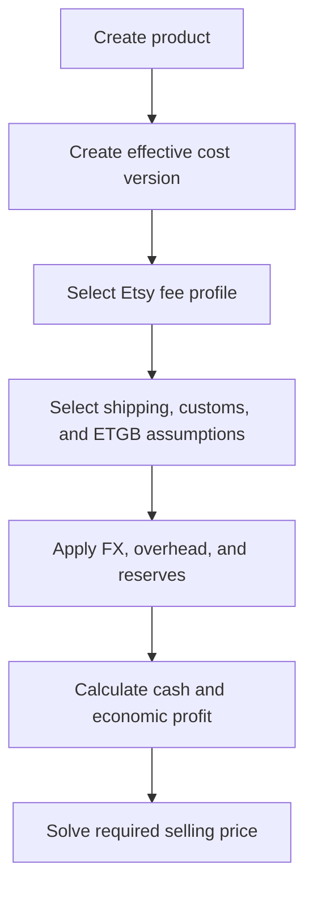
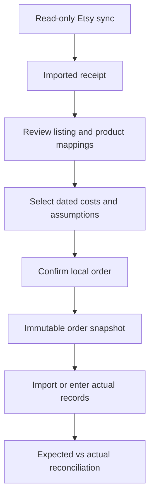
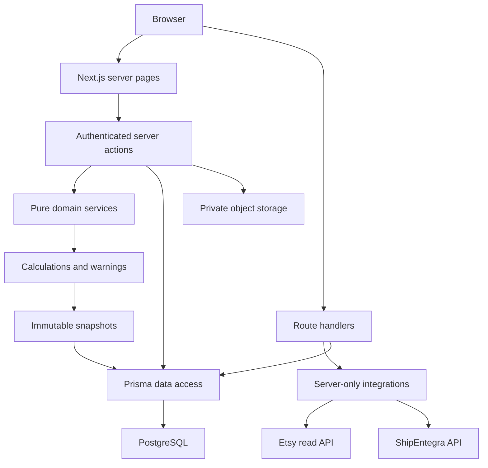

# MarmaraMade Ledger — Complete Product and Technical Documentation

## 1. Product overview

MarmaraMade Ledger is a private, single-administrator operations, financial-planning, and profitability application for MarmaraMade, a Turkey-based handmade bag business selling internationally through Etsy.

The system combines product costing, Etsy fee analysis, price recommendations, production and inventory records, shipping and customs planning, micro-export/ETGB evidence, business expenses, banking, tax-reserve planning, compliance, private documents, and Etsy financial reconciliation.

Its central business question is:

> After Etsy fees, product costs, labor, shipping, customs, overhead, reserves, and exchange-rate effects, how much does MarmaraMade earn from a product or order?

The application is designed for USD marketplace revenue and predominantly TRY business costs. It preserves both currencies and the exchange-rate snapshot used by each calculation.

It is not a tax-return engine, accounting filing product, customs broker, invoice provider, or legal decision system. Tax, VAT, SGK, customs, exemption, deductibility, and employment outputs are planning records requiring current official and professional confirmation.

## 2. Product objectives

The application provides five connected capabilities:

1. Calculate trustworthy product and order profitability.
2. Recommend prices required to achieve cash-profit, economic-profit, or margin targets.
3. Preserve the exact assumptions used for historical orders.
4. Compare expected Etsy, shipping, customs, and business costs with actual records.
5. Maintain the operational evidence needed to understand each sale.

## 3. Users and access model

The system is intentionally single-administrator.

The administrator can:

- configure the business and operating profile;
- manage products and effective-dated costs;
- create shipping, customs, fee, and tax assumptions;
- run profitability and sales-plan calculations;
- connect Etsy through read-only OAuth;
- import and confirm Etsy orders;
- reconcile actual financial records;
- manage inventory, production, banking, expenses, and documents;
- review security events and audit history.

There is no public customer interface, team workspace, or role-based multi-user system.

## 4. Core business principles

### 4.1 Planning data and actual data remain separate

Planning records include:

- product cost versions;
- Etsy fee profiles;
- exchange-rate snapshots;
- shipping and customs quotes;
- overhead assumptions;
- return, damage, exchange-loss, and tax reserves;
- goal scenarios.

Actual records include:

- imported Etsy receipts, payments, and ledger entries;
- confirmed local orders;
- bank transactions and Etsy payouts;
- paid expenses;
- actual shipping adjustments;
- actual customs charges;
- production and inventory movements;
- filed and paid tax records;
- verified supporting documents.

An estimate can be reconciled with an actual value, but the estimate is not overwritten.

### 4.2 Unknown values remain unknown

Missing customs, ETGB, tax, incoterm, delivery, exchange-rate, deductibility, SGK, or legal information is represented as unknown, pending confirmation, excluded, or estimated. The application does not invent a confident default to hide missing information.

### 4.3 Effective-dated configuration preserves history

Product costs, fee rules, legal profiles, tariff versions, tax rules, exemption limits, and similar assumptions can change over time. New information normally creates a new effective-dated version.

Historical orders keep references to the versions selected when they were confirmed.

### 4.4 Confirmed order economics are immutable

An imported Etsy receipt is an external record. It becomes a local order only after administrator review.

Confirmation selects the local product, cost version, fee profile, legal/business profile, exchange rate, shipping quote, customs quote, and related assumptions. The application then saves detailed cost lines and totals in an immutable snapshot.

Later corrections use adjustment or reconciliation records. They do not rewrite the snapshot.

### 4.5 Cash profit and economic profit are different

Cash profit reflects configured cash costs and reserves.

Economic profit additionally assigns an economic value to production labor. This reveals products that appear profitable only because maker time is unpaid or undervalued.

### 4.6 Financial arithmetic is decimal-safe

Money, rates, conversions, quantities, and percentages use decimal arithmetic through `decimal.js` and Prisma Decimal values. JavaScript floating-point arithmetic is not used for financial domain calculations.

## 5. Complete feature set

### 5.1 Product catalog

Products can store:

- SKU and title;
- description;
- material;
- primary and secondary colors;
- width and height;
- handle length;
- product weight;
- HS/customs code;
- lining and interior-pocket status;
- closure and base type;
- one-of-one status;
- active/inactive state;
- notes;
- associated documents;
- Etsy listing links;
- cost versions;
- material components;
- shipping and customs records.

### 5.2 Product costing

Each product can have multiple effective-dated cost versions.

A cost version can include:

- material component costs;
- material wastage rate;
- production labor hours;
- paid/planning hourly labor rate;
- separate economic hourly labor rate;
- packaging cost;
- additional maker payment;
- allocated equipment cost;
- other direct costs;
- change reason;
- template type;
- notes.

Product cost formula:

```text
material subtotal
+ material wastage
+ labor hours × planning labor rate
+ packaging
+ additional maker payment
+ allocated equipment cost
+ other direct cost
= direct product cost
```

Planning labor without accounting evidence is an economic cost and is not automatically treated as a deductible expense.

### 5.3 Profitability calculator

The calculator combines:

- seller revenue;
- Etsy fees and fee VAT;
- product cost;
- labor;
- domestic logistics;
- international shipping;
- customs and tariffs;
- ETGB/export cost;
- monthly overhead allocation;
- advertising;
- returns and damage reserves;
- exchange-loss reserve;
- other operating expenses;
- income-tax planning reserve;
- USD/TRY exchange rate.

The result contains both summary totals and line-by-line explanations with native currency, USD value, TRY value, base, rate, and formula.

### 5.4 Price recommendations

The application can solve for the minimum price needed to reach:

- a target cash profit;
- a target economic profit;
- a target cash margin;
- a target economic margin;
- a target TRY payout.

The solver uses bounded binary search so percentage fees, discounts, taxes on fees, reserves, and other nonlinear effects remain part of the result.

### 5.5 Profitability grades and warnings

Products can receive grades A, B, C, or D using configured profit and margin thresholds.

Risk flags include:

- negative profit;
- low profit;
- critically low margin;
- cash-profitable but economically loss-making;
- missing labor data;
- shipping-heavy economics;
- overhead-heavy economics;
- customs-sensitive economics.

Warnings also identify missing customs exposure, excluded customs, unknown ETGB, stale or mismatched quotes, non-DDP US assumptions, expired quotes, and mismatched HS codes.

### 5.6 Sales planning

Sales plans can calculate:

- planned units;
- projected seller revenue;
- projected variable costs;
- contribution per unit;
- total contribution;
- annual fixed business costs;
- aggregate pre-tax profit;
- taxable planning profit;
- tax reserve;
- final cash profit;
- economic labor cost and profit;
- production hours;
- cash margin;
- break-even units;
- remaining units to break even;
- monthly break-even sales.

Tax reserve is calculated on aggregate business profit, rather than summing independently rounded per-unit tax estimates.

### 5.7 Goals and product-mix optimization

Saved goals preserve:

- target and currency;
- period;
- legal operating profile;
- planning mode;
- exchange rate;
- fee profile;
- products and mix;
- stock and labor constraints;
- warnings;
- results and calculation snapshot.

Current exchange rates never silently change a saved goal. Recalculation creates a new version.

Average-product mode calculates required units using full unit economics. Zero or negative profit is reported as infeasible.

Product-combination and inventory modes use bounded search over stock, units, and labor. Capped results are identified as approximate. One-of-one products are not treated as replenishable unless explicitly configured.

### 5.8 Etsy read-only import

The integration imports:

- shop identity and metrics;
- listings;
- listing images;
- listing inventory, SKUs, and variations;
- receipts/orders;
- receipt items;
- payments;
- payment-account ledger entries;
- ledger-associated payments.

Imported Etsy data never overwrites local products or confirmed order snapshots.

### 5.9 Etsy order confirmation

Before an Etsy receipt becomes a confirmed order, the administrator reviews:

- listing-to-product mapping;
- SKU conflict status;
- product cost version;
- fee profile;
- business profile;
- legal operating profile;
- exchange rate;
- shipping quote;
- customs quote;
- order items;
- document checklist requirements.

Confirmation creates the local order, order items, calculation snapshot, calculation lines, and compliance checklist.

### 5.10 Etsy financial reconciliation

Expected Etsy fees come from effective fee rules. Actual fees come from imported payment and ledger records.

Unknown ledger descriptions are stored as `OTHER`, assigned zero confidence, and marked for manual review.

Payout allocation and bank matching support:

- multiple orders in one payout;
- one order across multiple records;
- fee reconciliation;
- foreign-exchange reconciliation;
- deposit reconciliation.

Confirmed fee changes create new effective-dated fee profiles. They do not rewrite historical profiles.

### 5.11 Shipping planning

Shipping quotes can store:

- optional product;
- origin and destination;
- carrier and service;
- incoterm;
- package dimensions;
- actual, volumetric, and billable weight;
- shipping currency and price;
- insurance;
- fuel surcharge;
- remote-area, pickup, and other fees;
- quote and expiry date;
- service transit range when known;
- estimate/actual status;
- source and notes;
- planning-default state;
- actual reconciled shipping cost.

Quotes are dated snapshots. Actual shipping is an adjustment and never overwrites the original quote.

### 5.12 Customs and tariffs

Customs planning separates:

- HS classification;
- product material and category;
- country of origin;
- destination;
- declared value;
- duty rate and amount;
- additional tariff rate and amount;
- carrier-processing charge;
- brokerage;
- customs-clearance charge;
- insurance;
- destination tax and other fees;
- customs payer;
- incoterm;
- inclusion in seller profit;
- confirmation and estimate status;
- effective date and expiry;
- actual destination charges.

Expired, unconfirmed, or mismatched information produces warnings. A customs estimate never becomes a permanent legal classification.

### 5.13 Micro-export and ETGB

A micro-export case can link:

- confirmed order;
- exporter;
- shipment;
- invoice/proforma;
- customs evidence;
- ETGB status;
- ETGB cost;
- private ETGB document.

ETGB remains pending until verified. Remote ETGB retrieval is not documented by the logistics API, so the file is uploaded manually.

### 5.14 Materials and production

The application supports:

- material definitions;
- material purchase lots;
- immutable material inventory transactions;
- production batches;
- maker assignment;
- planned and actual quantity;
- labor and cost-version references;
- individual production units;
- one-of-one state;
- immutable finished-inventory transactions.

Corrections use new inventory transactions rather than editing old movements.

### 5.15 Banking and payments

The system stores:

- bank accounts;
- payment cards;
- masked identifiers/final digits;
- bank transactions;
- transaction matching;
- owner capital contributions;
- owner advances;
- owner withdrawals;
- Etsy payouts;
- payout reconciliation.

Personal instruments used temporarily for business can be marked and generate reconciliation warnings.

Owner contributions and advances are financing, not revenue. Owner withdrawals are not deductible expenses.

### 5.16 Expense management

Expense records preserve:

- native currency and amount;
- TRY conversion;
- VAT;
- payment status;
- document association;
- allocations;
- deductibility status;
- VAT-deductibility status;
- soft-deletion history.

Deductibility defaults to unknown and changes only through recorded confirmation or explicit override.

Recurring expenses remain planning expectations and do not become actual expenses automatically. Planning depreciation remains separate from accountant-confirmed depreciation.

### 5.17 Cash flow

Cash-flow summaries use:

- bank credits and debits;
- Etsy payouts;
- paid expenses;
- tax and SGK payments;
- owner contributions;
- owner withdrawals.

Cash flow remains separate from economic profit. Planning labor and overhead can reduce economic profit without creating a current bank payment. Estimated tax remains separate from filed and paid tax.

### 5.18 Sales documents and invoicing

Sales documents begin as drafts linked to local orders. They preserve validation results, amount, currency, provider reference, status, and private document association.

The application does not call unsupported invoice-provider operations. Issuance format, numbering, and tax treatment require current provider/accountant confirmation.

### 5.19 Business formation

The formation checklist covers:

- business establishment;
- tax office;
- bank account;
- e-document setup;
- Etsy configuration;
- ShipEntegra configuration;
- customs and ETGB setup;
- privacy;
- accountant;
- SGK.

Changes are administrator-only, validated, and audited. Completion indicates recorded evidence, not a legal conclusion. Blocked and pending-confirmation states remain visible.

### 5.20 Legal operating profiles

Legal profiles are effective-dated and preserve historical order relationships.

The configured current operating structure represents Hamit Can Arslan as sole-proprietorship owner and operator, Etsy account holder, exporter, invoice issuer, bank-account holder, shop manager, photographer, packaging operator, and customer-service operator.

Selda is represented as maker, designer, and family contributor. The application does not infer employment, supplier, SGK, tax, compensation, or deductibility treatment from these roles.

Identity differences, missing tax-office data, incomplete customs registration, missing e-document settings, and pending accountant confirmation generate warnings.

### 5.21 Artisan tax-exemption planning

The module can store:

- certificate evidence;
- SGK confirmation status;
- dated annual limits and sources;
- gross revenue;
- payouts;
- expected and actual bank withholding.

Annual limits are versioned data. Usage warnings occur at 50%, 75%, 90%, and 100%. Reaching the limit prompts professional review but does not assert an automatic legal result.

Withholding defaults to unknown pending confirmation. Etsy net payout is not assumed to be the legal withholding base.

### 5.22 Sole-proprietorship planning

Monthly accountant fees, social-security cost, invoicing software, banking, office/registration, and other overhead are stored as separate TRY inputs.

4/a employment, possible 4/b exposure, VAT treatment, tax reserve, and maker labor/supplier treatment are configurable or professionally confirmed records. The application does not decide their official consequences.

### 5.23 SGK tracking

Monthly records keep 4/a evidence, 4/b status, debt, payment, and confirmation separate. Unknown is the default.

The system does not conclude that 4/a prevents 4/b or that family contribution automatically creates or avoids employment/insurance obligations.

### 5.24 Tax tracking

Tax rules are effective-dated and include confirmation state.

The system keeps separate:

- estimated amount;
- filed amount;
- paid amount;
- VAT input/output planning;
- filed VAT liability;
- salary income;
- business income estimate.

Salary and business income are not merged automatically.

### 5.25 Compliance cases

A compliance case stores:

- institution;
- channel;
- official reference;
- private evidence;
- question and response;
- status history.

Lifecycle states include draft, submitted, waiting, response received, clarification, and resolved.

An official response does not automatically change legal settings. A reviewed change creates a new effective-dated profile or rule.

### 5.26 Private documents

Documents can be connected to products, orders, shipping/customs quotes, compliance cases, expenses, invoices, and other records.

Stored metadata includes:

- category;
- lifecycle status;
- confidentiality level;
- original and sanitized filename;
- MIME type;
- size;
- SHA-256 checksum;
- private object path;
- related business record;
- verification and archive timestamps.

Uploads reject empty/oversized content, dangerous extensions, unapproved MIME types, signature mismatches, and duplicate checksums.

Private paths contain only a year, random UUID, and safe extension. They never contain names, receipt IDs, tax IDs, or original filenames.

Downloads recheck administrator authorization and return private, non-cacheable responses.

Archiving is a soft delete. Permanent deletion requires the record to be archived and requires an exact confirmation phrase. Verification, archive, and deletion are audited.

### 5.27 Accountant handoff

Monthly accountant periods track:

- expected document count;
- uploaded and missing records;
- collection state;
- readiness;
- transmission;
- review;
- completion;
- locking;
- reopening.

Locking is audited and does not modify or delete source documents. Exports contain metadata and exclude storage credentials or direct private object locations.

### 5.28 Order dossier

A complete order dossier can include:

- immutable financial snapshot;
- subsequent adjustments;
- legal/fee/cost/rate/quote versions;
- Etsy receipt, payment, and ledger evidence;
- product and package photographs;
- invoice or proforma;
- logistics label and invoice;
- ETGB;
- customs calculation;
- tracking history;
- payout and bank reconciliation;
- material/production evidence.

Checklist rules can vary by destination, operating mode, incoterm, carrier, return state, exemption state, and confirmation state.

Compliance becomes complete only when every applicable required item is verified.

## 6. End-to-end workflows

### 6.1 Product-to-price workflow



### 6.2 Etsy sale workflow



### 6.3 Compliance workflow

1. Open a case for an official question.
2. Record institution, channel, and reference.
3. Attach private evidence.
4. Move through draft, submitted, waiting, response, clarification, and resolution.
5. Review the answer.
6. Create a new effective-dated profile/rule when the answer changes operating treatment.
7. Preserve the case and old configuration for history.

### 6.4 Shipment workflow

1. Confirm the local Etsy-linked order.
2. Verify order items and legal profile.
3. enter package and destination information;
4. retrieve and persist quotes;
5. review price components and customs assumptions;
6. create an unchanged preview hash;
7. require explicit one-time administrator confirmation;
8. prevent duplicates with unique references and an operation record;
9. store manual shipment identifiers when remote creation is unavailable;
10. synchronize tracking and record actual cost adjustments.

## 7. Profitability calculation model

### 7.1 Revenue

```text
gross seller revenue
  = item subtotal
  + shipping charged to buyer
  + gift wrap charged to buyer
  - seller-funded discount
```

Etsy-funded discounts do not reduce seller revenue. Buyer tax collected by Etsy is not seller revenue.

### 7.2 Etsy costs

Supported deductions:

- listing charge × number of charges;
- transaction percentage × gross seller revenue;
- payment-processing percentage × processing base;
- fixed TRY payment-processing charge;
- regulatory operating fee;
- conditional currency-conversion fee;
- Offsite Ads percentage with configured maximum;
- entered Etsy Ads cost;
- optional deposit fee;
- VAT on explicitly eligible seller fees.

Fee rates come from effective-dated profiles and rules, not hidden UI constants.

### 7.3 Logistics

Domestic logistics can include transfer, travel to carrier branch, pickup, and non-partner shipment cost.

International logistics can include base shipping and insurance.

Volumetric weight:

```text
length × width × height ÷ volumetric divisor
```

Billable weight is the larger of actual and volumetric weight.

### 7.4 Customs

```text
duty amount       = declared value × duty rate
additional tariff = declared value × additional tariff rate
customs exposure  = duty + tariff + processing + brokerage
                    + clearance + insurance + destination fees
```

Entered fixed duty/tariff amounts override calculated amounts when supplied.

Customs exposure is always visible. It is deducted from seller profit only when seller-paid customs is enabled.

### 7.5 Overhead

Allocation methods:

- expected monthly sales;
- actual monthly sales;
- manual per-order allocation;
- no allocation.

For expected/actual modes:

```text
overhead per order = monthly overhead ÷ selected order volume
```

Annual fixed cost can be allocated by expected annual sales, charged in full, or excluded.

### 7.6 Reserves

Return, damage, and exchange-loss reserves are percentages of gross seller revenue.

Tax reserve applies to positive planning profit only.

With micro-export planning treatment:

```text
taxable planning base = max(0, estimated pre-tax profit) × 50%
tax reserve           = taxable planning base × reserve rate
```

Without the benefit:

```text
taxable planning base = max(0, estimated pre-tax profit)
tax reserve           = taxable planning base × reserve rate
```

### 7.7 Profit levels

```text
gross revenue
- Etsy fees and fee VAT
- product cost excluding labor
- domestic logistics
- international shipping
- included ETGB
- included seller-paid customs
- return and damage reserves
= contribution profit

contribution profit
- planning labor
= profit after labor

profit after labor
- allocated overhead
= operating profit

operating profit
- exchange-loss reserve
- other operating expense
= estimated pre-tax profit

estimated pre-tax profit
- tax reserve
= estimated after-reserve cash profit
```

Economic profit additionally subtracts production hours multiplied by the economic hourly rate.

### 7.8 Margins and unit metrics

The system calculates:

- contribution margin;
- operating margin;
- after-reserve cash margin;
- economic margin;
- cash profit per unit;
- economic profit per unit;
- cash profit per production hour;
- economic profit per production hour.

## 8. Pages and subpages

### 8.1 Dashboard — `/`

Provides the overall business view, financial metrics, alerts, summaries, and charts.

### 8.2 Profitability and planning

| Page | Route | Purpose |
|---|---|---|
| Calculator | `/calculator` | Unit economics and price solving |
| Sales plan | `/sales-plan` | Annual projection, tax reserve, fixed costs, and break-even |
| Goals | `/goals` | Versioned targets, product mix, stock/labor constraints |
| Reports | `/reports` | Financial and operational summaries |
| Printable report | `/reports/print` | Print-oriented report output |

### 8.3 Catalog, production, and inventory

| Page | Route | Purpose |
|---|---|---|
| Products | `/products` | Product catalog, dimensions, customs data, and cost versions |
| Materials | `/materials` | Materials, purchase lots, and material stock |
| Production | `/production` | Production batches and individual units |
| Inventory | `/inventory` | Finished-goods inventory movements |

### 8.4 Etsy and orders

| Page | Route | Purpose |
|---|---|---|
| Etsy settings | `/settings/etsy` | Connection, scopes, and health |
| Etsy import | `/etsy-import` | Sync runs, listings, receipts, payments, and errors |
| Receipt review | `/etsy-import/receipts/[id]` | Mapping and local order confirmation |
| Etsy payouts | `/etsy-payouts` | Payout records and allocations |
| Reconciliation | `/reconciliation` | Expected-versus-actual financial comparison |
| Orders | `/orders` | Confirmed order list |
| Order dossier | `/orders/[id]` | Snapshot, adjustments, documents, and checklist |

### 8.5 Shipping and customs

| Page | Route | Purpose |
|---|---|---|
| Shipping | `/shipping` | Manual and product-specific quotes and actuals |
| Customs | `/customs` | Customs profiles, tariff versions, and estimates |
| Customs/ETGB | `/customs-etgb` | Micro-export cases and ETGB records |
| ShipEntegra | `/shipentegra` | Quotes, shipments, tracking, and files |
| ShipEntegra settings | `/settings/shipentegra` | Credentials/configuration health |

### 8.6 Finance

| Page | Route | Purpose |
|---|---|---|
| Banking | `/banking` | Accounts, cards, bank records, owner movements, matching |
| Expenses | `/expenses` | Actual and recurring expenses, VAT, allocations, assets |
| Cash flow | `/cash-flow` | Cash movements separated from economic profit |
| Invoices | `/invoices` | Sales document and invoice lifecycle |

### 8.7 Business, tax, and compliance

| Page | Route | Purpose |
|---|---|---|
| Business | `/business` | Business profile, people, and operational roles |
| Formation | `/formation` | Formation checklist and evidence |
| Taxes | `/taxes` | Rules, obligations, VAT periods, and estimates |
| Tax exemption | `/tax-exemption` | Artisan-exemption evidence and annual limits |
| SGK | `/sgk` | Monthly 4/a/4/b status, debt, and evidence |
| Compliance | `/compliance` | Official questions, responses, and evidence |
| Documents | `/documents` | Private document repository |
| Accountant | `/accountant` | Monthly handoff and locking |
| Audit log | `/audit-log` | Administrative and system events |

### 8.8 Settings and authentication

| Page | Route | Purpose |
|---|---|---|
| Login | `/login` | Administrator sign-in |
| Settings | `/settings` | General application settings |
| Security | `/settings/security` | Session and security guidance |

## 9. UI and UX

### 9.1 Visual language

The application uses a restrained boutique-business design:

- dark forest-green navigation;
- warm stone/off-white surfaces;
- pale green accents;
- rounded cards and controls;
- compact labels and status pills;
- amber warning panels;
- clear financial hierarchy.

### 9.2 Navigation

Desktop uses a sticky, full-height, grouped sidebar. Groups automatically expand when a child route is active and can be manually collapsed.

Mobile uses horizontally scrollable top navigation. Content grids collapse into stacked layouts.

Navigation groups organize product/production, orders/Etsy, logistics, finance, compliance/business, and settings.

### 9.3 Language

The business UI is primarily Turkish. Code, database identifiers, and this technical documentation use English.

Shared navigation and repeated copy are centralized in the Turkish translation module.

### 9.4 Information presentation

UI components include:

- metric cards;
- structured forms;
- financial breakdown tables;
- historical tables;
- charts;
- lifecycle badges;
- warnings;
- calculation formulas;
- print layouts.

Financial screens present sources, assumptions, warnings, and calculation steps rather than only a final number.

### 9.5 Rendering model

Pages are server-rendered by default. Client components are limited to interactive workspaces, charts, navigation state, and browser-specific interactions.

Private financial/database access remains on the server.

## 10. Technical architecture



### 10.1 Application layer

- Next.js App Router pages render modules.
- Server actions handle authenticated form mutations.
- Route handlers provide OAuth, webhook, export, private download, health, quote, and cron endpoints.
- Shared components provide the application shell, navigation, calculator workspace, charts, reports, and simulators.

### 10.2 Domain layer

Pure domain modules implement:

- money and currency conversion;
- product cost;
- fee-profile application;
- profitability calculation;
- price solving;
- overhead allocation;
- sales planning;
- tax-reserve planning;
- goal optimization;
- quote warnings;
- validation.

### 10.3 Persistence layer

Prisma connects to PostgreSQL through the PostgreSQL driver adapter.

Persistence uses:

- SQL migration history;
- relational foreign keys;
- unique external IDs;
- indexes;
- effective-dated versions;
- immutable snapshot rows;
- audit/security records;
- idempotent integration upserts.

### 10.4 Integration layer

Etsy and ShipEntegra have isolated server-only clients, authentication, endpoint definitions, Zod schemas, rate-limit handling, mapping, redaction, and persistence logic.

## 11. Technology stack

| Category | Technology |
|---|---|
| Runtime | Node.js 22.x |
| Framework | Next.js 16.2 |
| UI | React 19.2 |
| Language | TypeScript 5.9, ESM |
| Styling | Tailwind CSS 4.3 |
| Database | PostgreSQL |
| ORM | Prisma 7.8 |
| Database adapter | Prisma PostgreSQL adapter |
| Authentication | NextAuth 4.24 credentials/JWT |
| Validation | Zod 4 |
| Financial arithmetic | decimal.js |
| Charts | Recharts 3 |
| Icons | Lucide React |
| Documents | Private Vercel Blob |
| Tests | Vitest 4 |
| Linting | ESLint 9 |
| Formatting | Prettier 3 |
| Deployment | Vercel |

Production dependencies are pinned. Selected transitive versions are constrained through npm overrides.

## 12. Project structure

```text
app/
  actions/                  Server mutations by workflow
  api/                      Auth, OAuth, webhook, cron, export, file, and integration routes
  <module>/page.tsx         Server-rendered application pages

components/
  app-shell.tsx             Main application layout
  sidebar.tsx               Responsive grouped navigation
  calculator-workspace.tsx  Interactive unit calculator
  profitability-simulator.tsx
  dashboard-charts.tsx
  tax-planning-reserve.tsx

lib/
  auth/                     Login, lockout, session authorization
  business/                 Cross-module consistency warnings
  documents/                File validation and private paths
  domain/                   Financial calculations
  etsy/                     Read-only Etsy integration
  goals/                    Product-mix planning
  shipentegra/              Logistics integration
  env.ts                    Environment validation
  prisma.ts                 Prisma client
  reporting.ts              Shared reporting queries

prisma/
  schema.prisma             Current PostgreSQL model
  migrations/               PostgreSQL migration history
  migrations-sqlite-legacy/ Historical SQLite migration
  seed.ts                   Destructive demonstration seed

scripts/                    Build, password, and safety scripts
tests/                      Vitest suites
```

## 13. Database model

### 13.1 Catalog and costing

- `Product`
- `ProductCostVersion`
- `ProductMaterialCost`
- `Material`
- `MaterialPurchaseLot`
- `PackageProfile`

### 13.2 Production and inventory

- `ProductionBatch`
- `ProductionUnit`
- `MaterialInventoryTransaction`
- `FinishedInventoryTransaction`

### 13.3 Planning inputs

- `FeeProfile`
- `FeeRule`
- `BusinessProfileVersion`
- `ExchangeRateSnapshot`
- `ShippingQuote`
- `CustomsQuote`
- `CostAssumptionProfile`
- `MonthlyOverhead`
- `RecurringBusinessCost`

### 13.4 Orders and calculation history

- `Order`
- `OrderItem`
- `OrderCostSnapshot`
- `OrderCostLine`
- `OrderAdjustment`
- `ShippingCostAdjustment`
- `CustomsActualCharge`

### 13.5 Etsy

- `EtsyConnection`
- `EtsyOAuthState`
- `EtsySyncRun`
- `EtsySyncError`
- `EtsyListing`
- `EtsyListingImage`
- `EtsyListingProductLink`
- `EtsyReceipt`
- `EtsyReceiptItem`
- `EtsyPayment`
- `EtsyLedgerEntry`
- `EtsyWebhookEvent`
- `EtsyImportMapping`
- `EtsyPayout`
- `EtsyPayoutReconciliation`

### 13.6 Logistics

- `ShipEntegraConnection`
- `ShipEntegraQuote`
- `ShipEntegraConfirmation`
- `ShipEntegraShipmentOperation`
- `ShipEntegraShipment`
- `ShipEntegraTrackingEvent`
- `ShipEntegraShipmentSnapshot`
- `ShipEntegraApiCall`
- `CustomsProfile`
- `TariffVersion`
- `MicroExportCase`
- `EtgbCostRecord`

### 13.7 Finance and business operations

- `BusinessProfile`
- `BusinessPerson`
- `BusinessPersonRole`
- `FormationTask`
- `BankAccount`
- `PaymentCard`
- `BankTransaction`
- `BankTransactionMatch`
- `OwnerTransaction`
- `Expense`
- `RecurringExpense`
- `ExpenseAllocation`
- `FixedAsset`
- `SalesDocument`

### 13.8 Legal, tax, and compliance

- `LegalOperatingProfile`
- `TaxExemptionLimitVersion`
- `TaxRuleVersion`
- `TaxObligation`
- `VatPeriod`
- `IncomeTaxEstimate`
- `SgkMonthStatus`
- `AccountantPeriod`
- `ComplianceCase`
- `StoredDocument`
- `DocumentRequirementRule`
- `OrderDocumentChecklist`
- `OrderDocumentChecklistItem`
- `WithholdingRecord`

### 13.9 Goals and reporting

- `ProfitGoal`
- `ProfitGoalVersion`
- `GoalScenario`
- `GoalScenarioProduct`
- `GoalScenarioResult`
- `MonthlyActualSummary`
- `Scenario`
- `ScenarioResult`
- `ExternalCalculatorComparison`

### 13.10 Security and audit

- `LoginAttempt`
- `AdminSecurityEvent`
- `AuditLog`
- `AppSetting`

## 14. API and server operations

| Route | Method | Function |
|---|---|---|
| `/api/auth/[...nextauth]` | Auth handler | Login and session |
| `/api/health` | GET | Deployment/database health |
| `/api/documents/[id]` | GET | Authenticated private download |
| `/api/exports/[entity]` | GET | Authenticated date-bounded CSV export |
| `/api/etsy/oauth/start` | GET | Start Etsy PKCE authorization |
| `/api/etsy/oauth/callback` | GET | Validate state and exchange code |
| `/api/etsy/sync` | POST | Authenticated read-only sync |
| `/api/etsy/webhook` | POST | Signature-verified Etsy notification |
| `/api/shipentegra/health` | GET | Integration status |
| `/api/shipentegra/quotes` | POST | Quote retrieval and persistence |
| `/api/cron/shipentegra-tracking` | GET | Secret-protected tracking sync |

Server-action groups cover ledger/cost/orders/goals/documents, business/finance/inventory/tax, Etsy connection/import, listing mapping, business formation, and ShipEntegra workflows.

All private reads and writes require administrator authorization. Form and API inputs are validated on the server.

## 15. Etsy integration contract

### 15.1 Scope boundary

The only permitted scopes are:

```text
shops_r listings_r transactions_r
```

Unknown scopes and any scope ending in `_w` are rejected. A violation changes connection status and disables synchronization.

Marketplace transport supports GET only. The sole outbound Etsy POST is the OAuth token endpoint for authorization-code exchange and token refresh. Inbound webhook POST requests are not marketplace mutations.

Automated tests and the Etsy guard fail if marketplace POST, PUT, PATCH, DELETE, or a generic arbitrary-method client is introduced.

### 15.2 OAuth lifecycle

1. Authenticated administrator starts connection.
2. Server generates a 32-byte random state and 48-byte PKCE verifier.
3. The S256 challenge is sent to Etsy.
4. Encrypted verifier and state hash remain in PostgreSQL for ten minutes.
5. Callback requires administrator session, exact state, unexpired/unused row, and authorization code.
6. State is consumed atomically before token exchange.
7. Access and refresh tokens are encrypted with AES-256-GCM.
8. Access token refresh occurs five minutes before expiry.

Changing scopes requires reconnection. Tokens never appear in browser UI, normal logs, errors, or audit metadata.

### 15.3 Synchronization

Supported modes:

- initial full;
- incremental;
- listings only;
- orders only;
- payments only;
- ledger only.

Offset pagination is used. Rate limits and eligible server errors use bounded retries. Permanent failures create partial runs and stored errors.

Every external object has a unique Etsy ID, source timestamp/hash, first import, last import, and last-change information. Upserts are idempotent.

### 15.4 Webhooks

Supported events:

- `order.paid`;
- `order.canceled`;
- `order.shipped`;
- `order.delivered`.

Verification:

```text
signed content = webhook ID + "." + webhook timestamp + "." + raw body
expected signature = Base64(HMAC-SHA256(decoded secret, signed content))
```

Events outside a five-minute timestamp window are rejected. Duplicate webhook IDs are idempotent. A valid event can initiate only a follow-up GET synchronization.

### 15.5 Unsupported Etsy behavior

The system cannot:

- create/edit/renew/deactivate listings;
- change inventory or prices;
- change shop data;
- fulfill, ship, cancel, or refund Etsy orders;
- add marketplace tracking;
- message buyers;
- manage Etsy webhooks;
- perform any marketplace mutation.

## 16. ShipEntegra integration contract

### 16.1 Authentication and environment

Production authentication exchanges client ID and secret for bearer access/refresh tokens. Credentials and tokens remain server-only. Only the production environment is configured.

### 16.2 Operation classification

| Operation | Category | Status |
|---|---|---|
| Token request | Authentication | Implemented |
| Calculate all services | Quote | Implemented and persisted |
| Tariff calculation | Quote | Not enabled |
| Create remote order | Shipment mutation | Guarded but fail-closed |
| Deprecated manual-order creation | Unsupported | Not implemented |
| Read manual orders | Read-only | Client implemented |
| Update/hold/unhold/post order | Mutation | Not enabled |
| Main label response | Document | Mapped |
| Upload/delete logistics files | Mutation/destructive | Not enabled |
| Read logistics files | Read-only | Implemented |
| Shipment activities | Tracking | Implemented |
| Currencies/carriers/stores | Read-only | Implemented |
| Remote ETGB update | Mutation | Not enabled |

### 16.3 Quote behavior

The system sends destination, package dimensions, actual weight, and other supported fields. Responses are validated, hashed, and stored with assumptions, time, price components, and optional expiry.

The quote response does not reliably establish delivery time or incoterm. The application does not infer DDP from a service name. US shipments with unknown/non-DDP treatment receive a warning and separate customs planning.

Postal codes are retained only in partial form.

### 16.4 Shipment safety

Remote shipment creation is disabled because the referenced API contract documents the request but not a reliable success response.

Before enablement, written confirmation is required for:

- production access and scopes;
- success/error codes and response examples;
- returned order, tracking, and label identifiers;
- idempotency and timeout recovery;
- IOSS field and confidentiality behavior;
- shipping-type mapping;
- DDP service support;
- final charges;
- label purchase/creation;
- cancellation, hold, and refund behavior;
- rate limits and `Retry-After` behavior;
- document and ETGB retrieval;
- tracking webhook or polling guidance;
- safe production testing;
- store identifier mapping.

### 16.5 IOSS rules

- Never invent IOSS.
- Never put the Turkish tax number in an IOSS field.
- Use only Etsy’s order-specific IOSS value for a qualifying order.
- Never persist it in logs, exports, audit payloads, screenshots, or visible parcel text.
- Transmit it electronically only through a vendor-confirmed field.
- Ineligible orders never inherit an IOSS value.

### 16.6 Tracking, files, and actual cost

Tracking events use a stable ID derived from tracking number, event date, and text.

Document categories include E-Archive, MSDS, TSCA, FDA, and Other. ETGB remains a manual private upload.

Actual shipping cost is an adjustment with an explicit source. It never overwrites the quote or order snapshot.

## 17. Exchange-rate handling

The application can parse USD/TRY rates from TCMB data.

Historical calculations use stored exchange-rate snapshots. A current rate never silently changes confirmed orders or saved goal versions.

Currency conversion direction:

```text
USD to TRY = USD amount × USD/TRY rate
TRY to USD = TRY amount ÷ USD/TRY rate
```

The rate must be positive.

## 18. Authentication and security

### 18.1 Authentication

- NextAuth credentials provider;
- administrator email;
- bcrypt password hash;
- JWT session strategy;
- secure cookies in production;
- configurable maximum session age;
- dedicated login page.

### 18.2 Authorization

Middleware protects all business routes except explicit authentication, health, cron, OAuth callback, webhook, and static-asset exceptions.

Protected pages and server actions authorize the administrator before database access. Private APIs use API-specific authorization behavior.

### 18.3 Login protection

Failed attempts are persisted. Configurable failure threshold and lockout duration protect the account. IP information is normalized and privacy-hashed.

### 18.4 Secret handling

Server-only secrets include:

- database URLs;
- auth secret;
- administrator password hash;
- Etsy credentials and tokens;
- token-encryption key;
- webhook secret;
- ShipEntegra credentials;
- Blob token;
- cron secret.

Passwords, authorization headers, tokens, buyer contact details, full addresses, tax IDs, private document content, and real credentials must not enter logs or version control.

### 18.5 Browser and HTTP protection

Configured protections include:

- Content Security Policy;
- HSTS in production;
- frame denial;
- MIME-sniffing prevention;
- restrictive browser permissions;
- strict referrer policy;
- server-only integration origins;
- spreadsheet-formula neutralization in CSV;
- redacted external errors.

### 18.6 Credential rotation

Administrator password:

1. Generate a new bcrypt hash locally.
2. replace the deployment password hash;
3. rotate auth secret to end sessions;
4. redeploy and verify login/lockout records.

Token-encryption key:

- controlled rotation decrypts with the old key and re-encrypts in one maintenance process;
- losing the key requires Etsy token revocation and reconnection;
- replacing the key without migrating ciphertext makes tokens unreadable.

Database credential:

1. create a new least-privilege credential;
2. update runtime/direct URLs;
3. deploy and test;
4. terminate old sessions;
5. revoke old credentials;
6. inspect audit data.

Webhook secret:

1. create/rotate secret;
2. update deployment;
3. test a signed event;
4. disable old endpoint/secret.

### 18.7 Incident response

1. Disable affected integrations and restrict infrastructure access.
2. Preserve privacy-safe logs, hashes, IDs, and timestamps.
3. Rotate affected credentials.
4. Revoke Etsy grants if token exposure is possible.
5. Inspect login, security, webhook, sync, API, and audit records.
6. Validate snapshots against backups without rewriting history.
7. Patch and run the complete verification suite.
8. Redeploy and verify scopes, authentication, and data integrity.
9. Record impact and remediation without publishing confidential data.

## 19. Environment configuration

### 19.1 Required

```dotenv
DATABASE_URL="postgresql://...pooled runtime connection..."
DIRECT_URL="postgresql://...direct migration connection..."
AUTH_SECRET="32+ random bytes"
ADMIN_EMAIL="administrator@example.invalid"
ADMIN_PASSWORD_HASH="$2b$12$..."
```

### 19.2 Authentication tuning

```dotenv
AUTH_MAX_FAILED_ATTEMPTS="5"
AUTH_LOCKOUT_MINUTES="15"
AUTH_SESSION_MAX_AGE_HOURS="8"
```

### 19.3 Etsy

```dotenv
TOKEN_ENCRYPTION_KEY="..."
ETSY_API_KEYSTRING="..."
ETSY_SHARED_SECRET="..."
ETSY_REDIRECT_URI="<production-origin>/api/etsy/oauth/callback"
ETSY_SCOPES="shops_r listings_r transactions_r"
ETSY_WEBHOOK_SIGNING_SECRET="..."
ETSY_RAW_PAYLOAD_RETENTION_DAYS="0"
```

### 19.4 ShipEntegra

```dotenv
SHIPENTEGRA_CLIENT_ID="..."
SHIPENTEGRA_CLIENT_SECRET="..."
SHIPENTEGRA_ENVIRONMENT="production"
SHIPENTEGRA_OPERATION_MODE="ADMIN_CONFIRMED_SHIPMENT"
SHIPENTEGRA_REQUEST_TIMEOUT_MS="15000"
SHIPENTEGRA_TRACKING_SYNC_ENABLED="false"
SHIPENTEGRA_TRACKING_SYNC_HOURS="6"
```

### 19.5 Documents and cron

```dotenv
BLOB_READ_WRITE_TOKEN="..."
DOCUMENT_MAX_SIZE_MB="25"
CRON_SECRET="..."
```

The server validates environment values with Zod. Optional integration credentials become required when their feature is invoked.

## 20. Local development

Prerequisites:

- Node.js 22.x;
- npm;
- private PostgreSQL development database.

Setup from the repository root:

```bash
npm ci
cp .env.example .env
npm run db:deploy
npm run dev
```

Available commands:

```bash
npm run dev
npm run build
npm run start
npm run lint
npm test
npm run test:watch
npm run format
npm run db:validate
npm run db:deploy
npm run db:migrate
npm run db:studio
npm run db:seed
npm run auth:hash-password
npm run guard:etsy-readonly
```

The seed deletes and replaces application records. Use it only with an empty/disposable database. Production seeding requires an explicit temporary override that must be removed immediately afterward.

## 21. Testing and verification

The repository baseline contains 225 tests in 14 Vitest files.

Coverage includes:

- unit-profit calculation;
- customs and quote warnings;
- fee profiles and VAT;
- income-tax planning reserve;
- aggregate sales-plan tax;
- profitability grading and solver;
- overhead allocation;
- goal usability;
- compliance, documents, and goals;
- exports and spreadsheet safety;
- auth middleware;
- Etsy scopes, OAuth, encryption, webhook, sync, and mapping;
- ShipEntegra quote/tracking/safety behavior;
- Turkish UI and shell contracts.

Verification commands:

```bash
npm run lint
npx tsc --noEmit
npm test
npm run db:validate
npm run guard:etsy-readonly
npm run build
npm audit
```

At the documentation baseline, lint, type checking, all 225 tests, Prisma validation, Etsy read-only guard, and production build passed.

The dependency audit reported current advisories in the resolved tree, including the pinned Next.js version and transitive tooling dependencies. Dependency upgrades require separate review and the complete regression suite.

## 22. Deployment

Production uses:

- Vercel;
- managed PostgreSQL;
- optional private Vercel Blob;
- Vercel Cron for tracking.

### 22.1 Database connections

Use a pooled PostgreSQL URL for serverless runtime traffic and a direct/non-pooling URL for Prisma migrations. SSL should be enabled through the provider connection string.

Never expose database URLs through public browser variables.

### 22.2 Build behavior

The build script:

1. generates Prisma Client;
2. applies committed migrations only in production deployment environment;
3. executes the Next.js production build.

Preview and local builds do not migrate production.

### 22.3 Deployment procedure

1. Create the Vercel project from the repository.
2. connect managed PostgreSQL;
3. configure pooled and direct connections;
4. create private object storage if documents are enabled;
5. configure authentication and cron secrets;
6. configure Etsy/ShipEntegra only when enabled;
7. run `npm ci` and `npm run db:deploy` from trusted release infrastructure;
8. deploy using Node.js 22.x;
9. complete post-deployment verification.

Do not use Prisma schema push, migration reset, or destructive seed against production.

### 22.4 Cron

Tracking synchronization runs daily at 03:00 UTC through the protected cron route. Requests require the cron bearer secret.

### 22.5 Post-deployment verification

1. Verify health endpoint.
2. verify unauthenticated redirect to login;
3. sign in with administrator credentials;
4. verify secure cookies and security headers;
5. verify protected database reads;
6. verify private documents reject anonymous requests;
7. verify Etsy callback, scopes, and listings-only sync if enabled;
8. verify ShipEntegra auth/quote without shipment creation if enabled;
9. verify cron rejects missing secret;
10. run release verification and dependency audit.

Preview deployments that write data require separate preview databases. Untrusted previews must never use production data.

## 23. Database migrations and recovery

### 23.1 Migration policy

- Back up before significant migration.
- Apply only committed migrations.
- Never edit an already-applied shared migration.
- Never use schema push/reset to repair production.
- Stop writes before manual migration or rollback.
- Export new metadata before destructive rollback.
- Remove constraints/tables in reverse dependency order.
- Decide private object-storage retention separately.

### 23.2 Major additive operations migration

The operations migration introduced business profiles/roles, formation, banking, expenses, assets, materials, production, payouts, sales documents, ShipEntegra, customs, tax, SGK, and accountant-period tables.

It backfilled the confirmed business profile and Hamit/Selda roles. It does not rewrite administrator sessions, Etsy tokens/imports, products, fees, exchange rates, orders, snapshots, documents, or goals.

### 23.3 Legacy SQLite-to-PostgreSQL procedure

1. Stop writes.
2. make an offline SQLite backup;
3. record table counts;
4. run SQLite integrity and foreign-key checks;
5. export into a protected staging artifact outside version control;
6. create an empty UTF-8 PostgreSQL database and least-privilege role;
7. apply committed schema;
8. load source into a staging schema;
9. preserve IDs, Decimal representations, timestamps, and effective ranges;
10. insert parent records before child records;
11. use idempotent conflict handling based on original IDs;
12. compare counts, keys, relations, Decimal totals, time ranges, and snapshot hashes;
13. commit only when every check passes;
14. run tests/build and inspect representative historical reports;
15. retain the read-only source backup through reconciliation.

Parent-before-child order:

1. products, packages, marketplace, fee profiles, business profiles, shipping/customs quotes, exchange rates, scenarios, overhead, and settings;
2. product-cost versions, fee rules, orders, and scenario results;
3. order items and cost snapshots;
4. cost lines and audit logs.

Historical mismatches are fixed in staging/import mapping, not by rewriting snapshots.

## 24. Known limitations

- Single administrator only.
- No per-device session revocation; auth-secret rotation ends all sessions.
- Database lockout is not a replacement for WAF/edge throttling.
- Etsy access depends on Etsy approval and available fields.
- Etsy integration is read-only.
- ShipEntegra remote shipment creation remains disabled because the success contract is incomplete.
- ETGB retrieval remains manual.
- Some cash-flow summaries consolidate TRY records only.
- Historical foreign-currency consolidation requires stored exchange-rate snapshots.
- Legal, tax, VAT, SGK, customs, tariffs, marketplace fees, and exemptions can change.
- The application does not submit tax, SGK, customs, ETGB, or invoice filings.
- There is no full browser end-to-end test suite.
- Dependency audit findings require ongoing review.

## 25. Data protection and disclaimer

The application minimizes imported buyer information. Etsy receipt records store the business data required for order economics and avoid buyer contact/full-address retention where unnecessary.

Audit metadata excludes credentials, tokens, document contents, addresses, and confidential identifiers.

MarmaraMade Ledger is private planning, record keeping, reconciliation, and decision support. It does not determine official tax liability, exemption eligibility, expense or VAT deductibility, SGK/Bağ-Kur liability, employment status, customs classification, duty, invoice validity, or legal compliance.

Final treatment requires current official information and, where appropriate, confirmation from a qualified accountant, customs professional, or lawyer.
